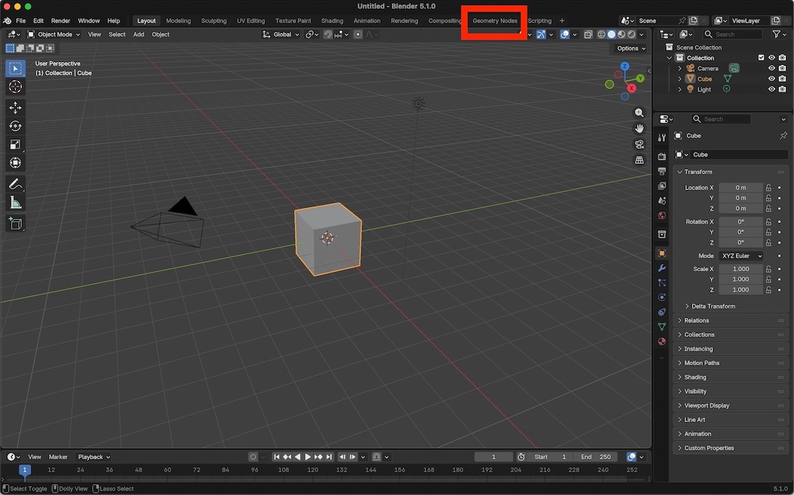
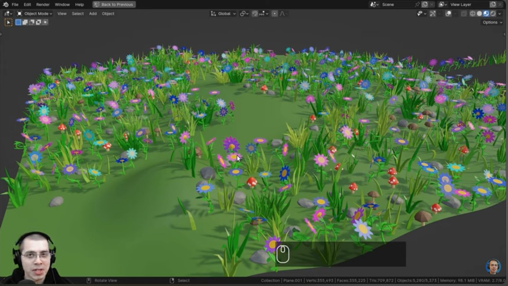

# Geometry Nodes:   Overview

Geometry nodes are graphical programming units that modify geometry.

This tutorial explains the basics of geometry nodes.  It is a simplified version of the [excellent tutorial](#excellenttutorial) described below.

The final goal of this tutorial is to produce a collection of vines / branches and leaves like those depicted in the image below.

    
     
    <em>Final tutorial goal: create vines/branches with leaves.</em>

 
 
 

# Accessing geometry nodes

The easiest way to access geometry nodes is through the **Geometry Nodes** workspace.

Details regarding the Geometry Nodes workspace and how to use it are described in subsequent tutorial pages.

    
     
    <em>Access geometry nodes through the "Geometry Nodes" workspace.</em>

 
 
 

# An excellent tutorial

[Ryan King Art](https://www.youtube.com/RyanKingArt) has created an excellent geometry nodes tutorial called [Geometry Nodes for Complete Beginners](https://www.youtube.com/watch?v=tWvgHbZXCtA&list=PLsGl9GczcgBsDZ3jQPwP1p6evNI22wevP).  That tutorial starts with the basics and works all the way up to an impressive flower field as depicted below.

    
     
    <em>An excellent geometry nodes tutorial by Ryan King Art.</em>

 
 
 
