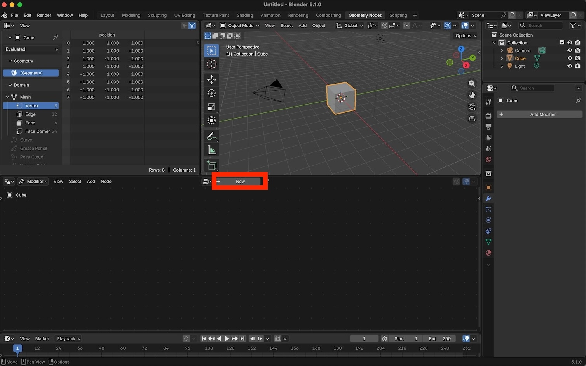
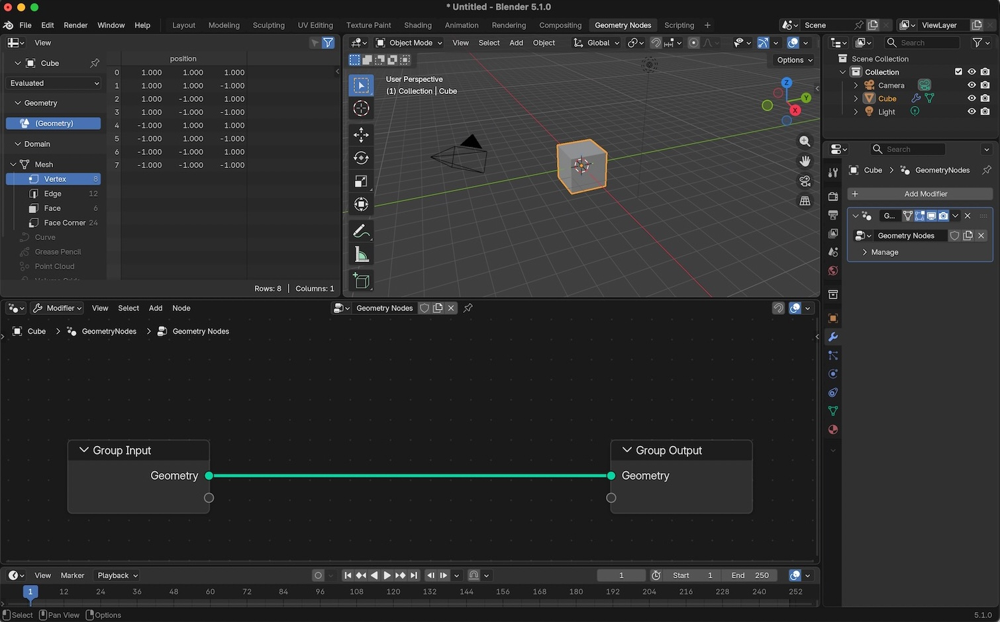
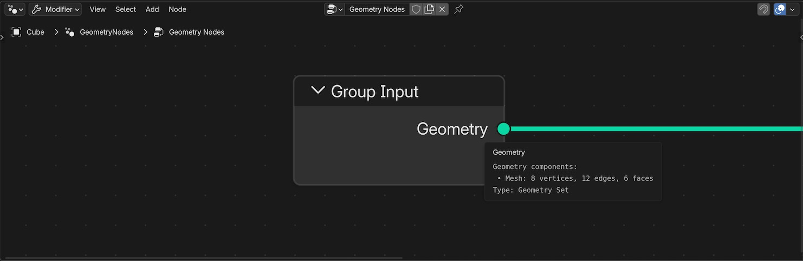
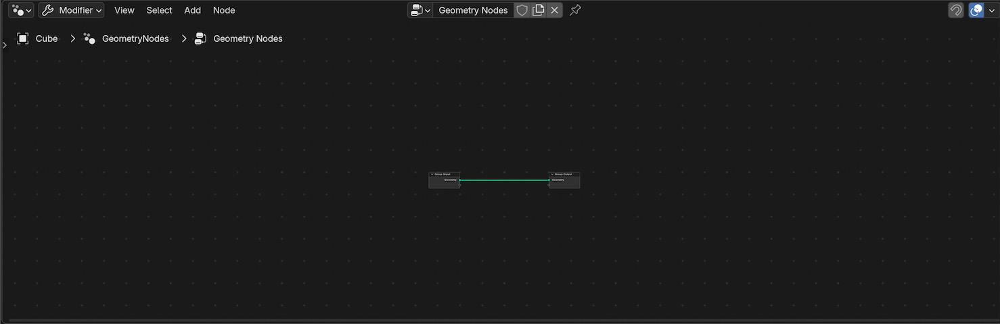
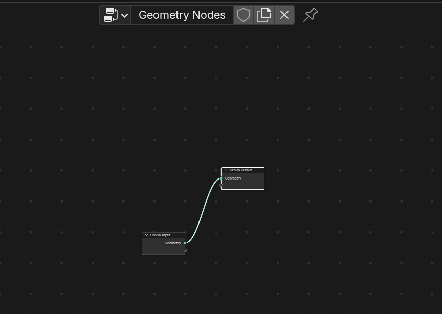
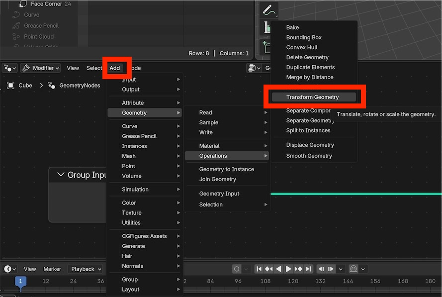
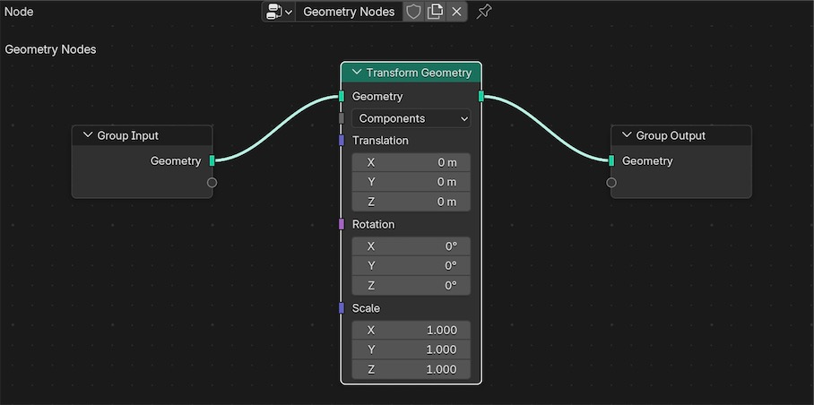
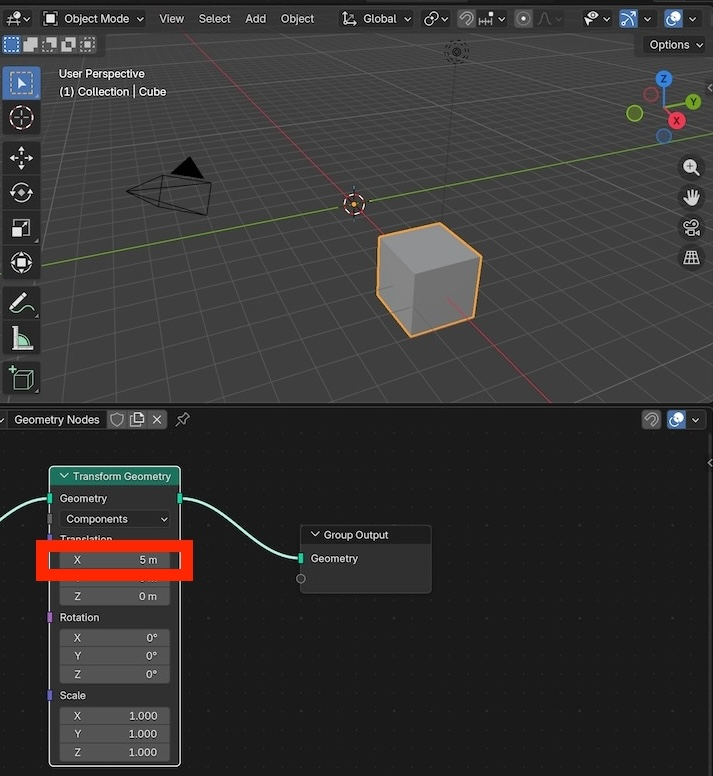

# Object Transforms

The most basic way to use geometry nodes (GN) is to transform objects.

"Transform" means: translate, rotate and scale.

<br>
<br>

# Create GN modifier 

Launch Blender and select the Geometry Nodes workspace. 

<center>
    
    <br>
		<br>
		<br>
</center>


Select "New" to create a new Geometry Nodes modifier:

<center>
    
    <br>
		<br>
		<br>
</center>


After creating the geometry nodes modifier you will two nodes: an input node and an output node.

Initially the input geometry (`Group Input`) is sent directly to the output geometry (`Group Output`).

<center>
    
    <br>
		<br>
		<br>
</center>


# Change view and move nodes

Use a two-finger swipe to pan your view of the Geomtery Nodes editor.

Use <kbd>CTRL</kbd> + two-finger swipe UP to zoom in.


<center>
    
    <br>
		<br>
		<br>
</center>

Use <kbd>CTRL</kbd> + two-finger swipe DOWN to zoom out.

<center>
    
    <br>
		<br>
		<br>
</center>

Just like in the 3D View, you can use the <kbd>G</kbd> key to translate nodes.

Select one of the nodes, press <kbd>G</kbd> and drag the mouse around. You will see that the nodes stay connected. Moving nodes does not affect the output geometry. Moving nodes simply allows you to keep all nodes visually organized.

<center>
    
    <br>
    <br>
		<br>
</center>


# Add a transform node

The "Add" menu in the Geometry Nodes Editor can be used to add a variety of geometry nodes.

From the Add menu select:

```
Add.. Geometry.. Operations.. Transform Geometry
```
<br>

<center>
    
    <br>
    <br>
		<br>
</center>


Drop the Transform Geometry node between the input and output nodes.

If you drop the node close to the existing connection between the input and output nodes, Blender will automatically create connections to and from the new node.

<center>
    
    <br>
    <br>
    <br>
</em>
</center>


# Adjust node values


Adjust the X value in the Transform Geometry node to a new value like 5.

Note that the selected object will transform when you change values in the Transform Geometry node.

Changing node parameters generally changes the output geometry

<center>
    
    <br>
    <br>
    <br>
</center>
