# Mesh modification


This mini-tutorial demonstrates how geometry nodes (GN) can be used to modify mesh geometry.

<br>
<br>


# Basic mesh modifiers

Before considering geometry nodes, let's first consider a more basic way to modify mesh.

Launch Blender and open the Modifiers tab of the Properties panel.


<center>
    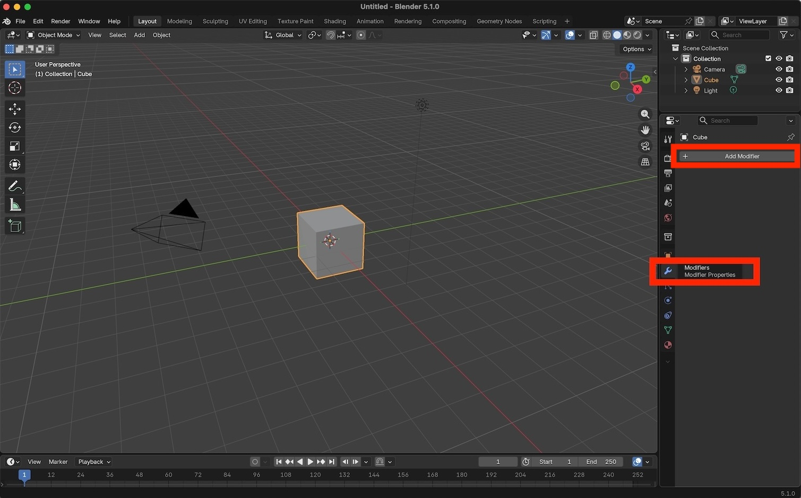
    <br>
    <em>Modifiers tab in the Properties panel.</em>
    <br>
		<br>
		<br>
</center>


Press the "Add Modifier" button and select the Bevel modifier.

 ```
 Add Modifier.. Generate.. Bevel
 ```


<center>
    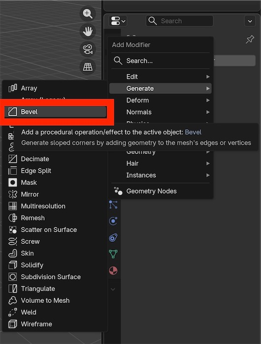
    <br>
    <br>
		<br>
</center>


Confirm that the cube's geometry has been modified with beveled (i.e., rounded) edges.


<center>
    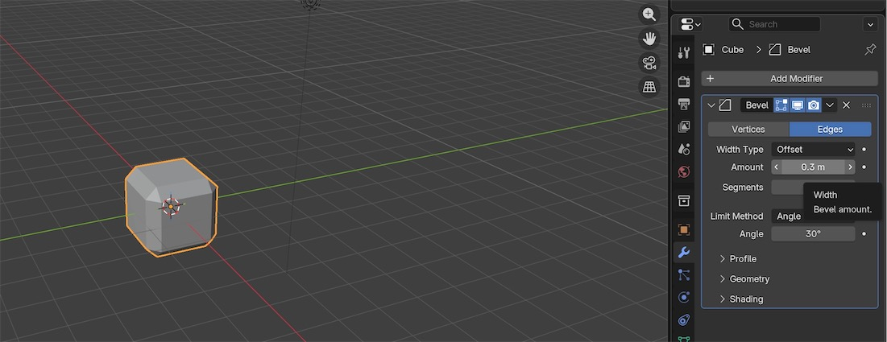
    <br>
    <em>Default bevel modifier applied to default cube.</em>
    <br>
    <br>
    <br>
</center>

<br>
<br>

# Geometry nodes modifier


"Geometry Nodes" is another type of modifier.

After pressing "Add Modifier" you will see "Geometry Nodes" at the bottom of the list.

The Geometry Nodes modifier is the most general, powerful and flexible modifier. 


<center>
    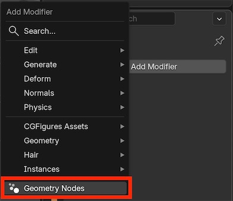
    <br>
    <br>
    <br>
</center>


Adding a GN modifier in the Modifiers tab creates a new modifer slot but does not actually create a new GN modifier.

You can press "New" to create a new GN modifier (i.e., the **right** "New" button in the screenshot below). 

This is exactly the same as creating a new GN modifier in the GN Editor (i.e., the **left** "New" button in the screenshot below).

<center>
    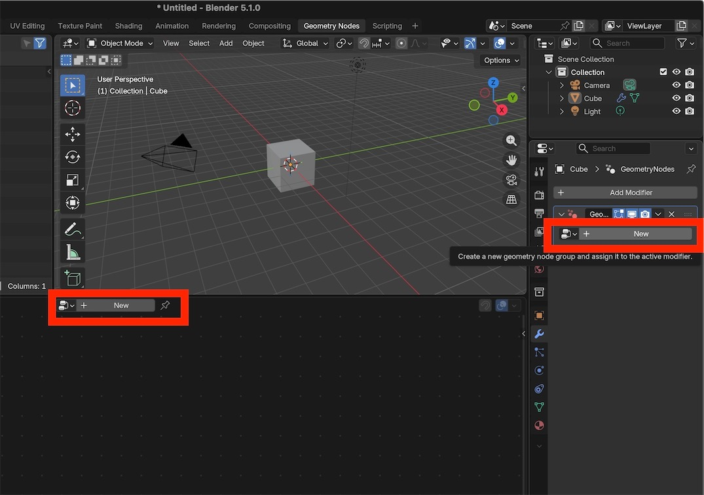
    <br>
    <em>Create a GN modifier from either the GN Editor (left) or the Modifiers tab (right).</em>
    <br>
    <br>
    <br>
</center>


After creating a GN modifer you will see the default nodes in the GN Editor.

<br>

<center>
    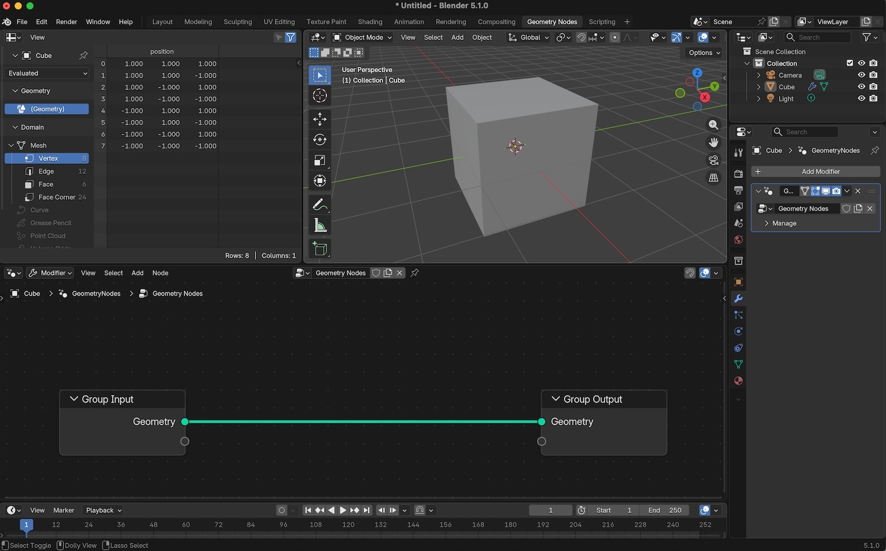
    <br>
    <em>The default GN modifier sends input geometry directly to output geometry.</em>
    <br>
    <br>
    <br>
</center>


Add a `Subdivision Surface` node:

``` 
Add.. Mesh.. Operations.. Subdivision Surface
```

Note that cube's geometry has been modified, and that it now looks more like a sphere.

Note also that the number of vertices, edges and faces has increased. You can see these in the Spreadsheet panel (top-left panel in the GN workspace).

For example, the original cube had just 8 vertices (one for each corner of the cube). The `Subdivision Surface` node has increased the number of vertices to 26.


<center>
    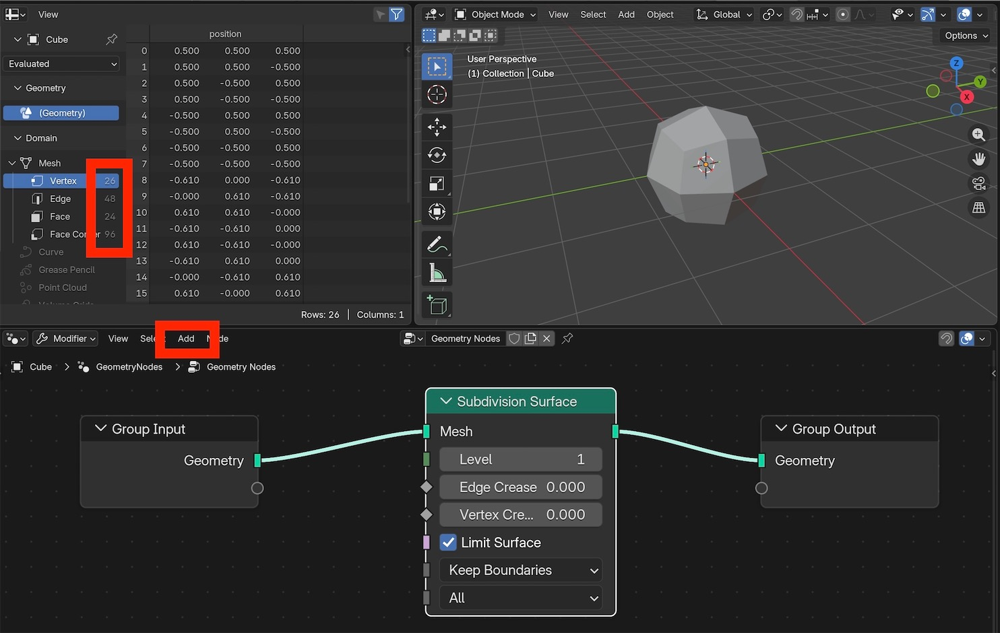
    <br>
    <em>Default Subdividision Surface modifier.</em>
    <br>
    <br>
    <br>
</center>


Let's change the `Subdivision Surface` node's parameters and see how they change the cube's mesh.

For example:

- Level = 4
- Edge Crease = 0.8

This produces an effect similar to the Bevel modifier above.

<center>
    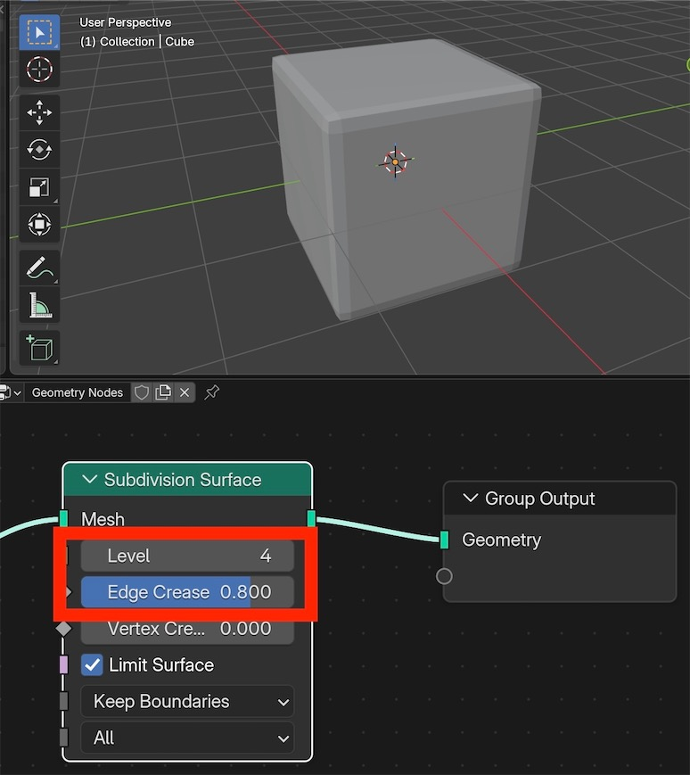
    <br>
    <em>Changing node parameter values generally changes the output geometry.</em>
    <br>
    <br>
    <br>
</center>


Let's next add a `Set Shade Smooth` node:

```
Add.. Mesh.. Write.. Set Shade Smooth
```

Note that the visualized geometry is now considerably more smooth.


<center>
    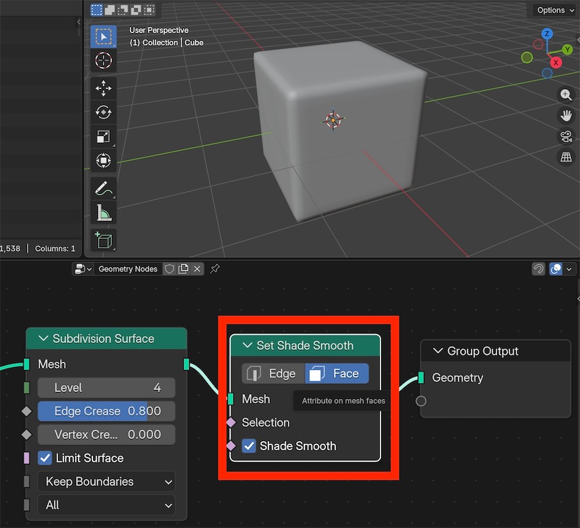
    <br>
    <em>The Set Shade Smooth node can be used to smooth rough mesh edges.</em>
    <br>
    <br>
    <br>
</center>


# Change modifier name


Each GN modifer has a name. By default the name is "Geometry Nodes", but you can change the name to any name you wish.

To change the name, click on the name and then edit the text.

For example, in the screenshot below the GN modifier's name has been changed to "MyGeometry"

<center>
    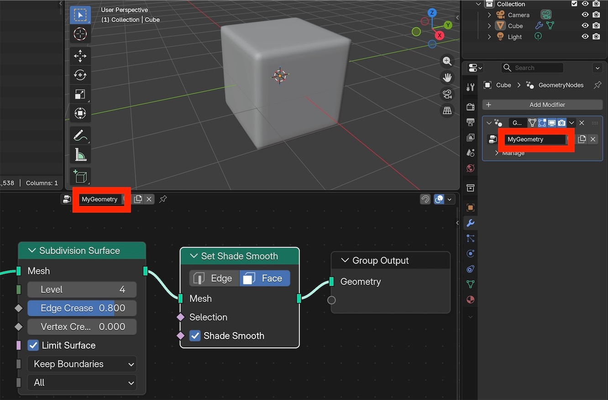
    <br>
    <em>A geometry nodes modifier's name can be changed by clicking on its name.</em>
    <br>
    <br>
    <br>
</center>


# Apply to a new object

A single GN modifier can be applied to multiple objects.

Let's explore this by first creating a monkey object. From the Add menu in the 3D Viewport:

```
Add.. Mesh.. Monkey
```

Drag the monkey away from the cube:  press <kbd>G</kbd> , drag the mouse, then press <kbd>ENTER</kbd> to apply the transform.

When the monkey is selected, nothing appears in the GN Editor because the monkey does not have a GN modifier.

If you were to click on the cube, you would see the previously created "MyGeometry" in the GN Editor.


<center>
    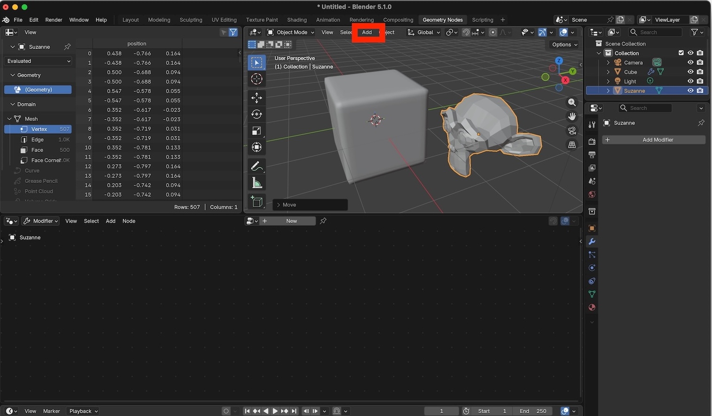
    <br>
		<em>If the selected object does not have a GN modifier, nothing will appear in the GN Editor.</em>
		<br>
    <br>
  	<br>
</center>


Add a GN modifier to the monkey.

<center>
    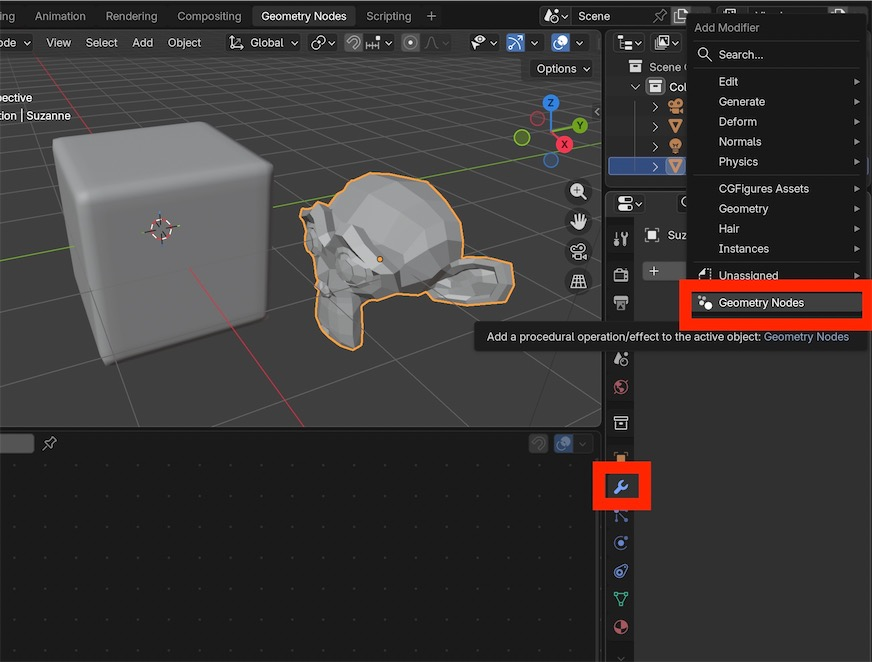
    <br>
    <br>
    <br>
</center>


Press the node tree icon to see a list of available GN modifiers.

Select the previously created MyGeometry modifier.

<center>
    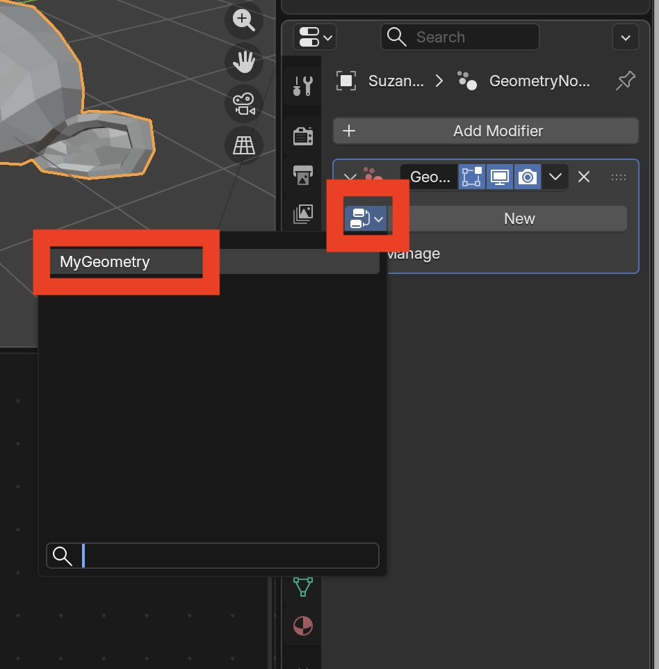
    <br>
    <em>Assign an existing GN modifier to any object.</em>
    <br>
    <br>
    <br>
</center>


After selecting the MyGeometry modifier, you will see that the monkey is somewhat smoother than before.

<center>
    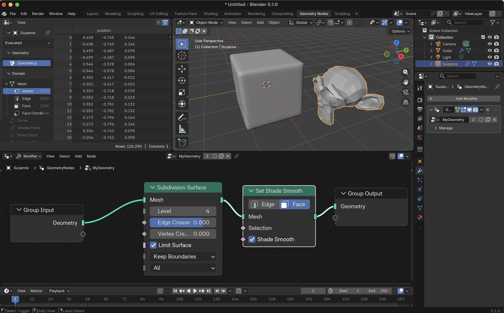
    <br>
    <em>A single GN modifier can be simultaneously applied to multiple objects.</em>
    <br>
    <br>
    <br>
</center>


Adjust some of the MyGeometry modifier properties.  For example:

- Level = 2
- Edge Crease = 0.1


Note that these changes affect **both** the cube **and** the monkey.


<center>
    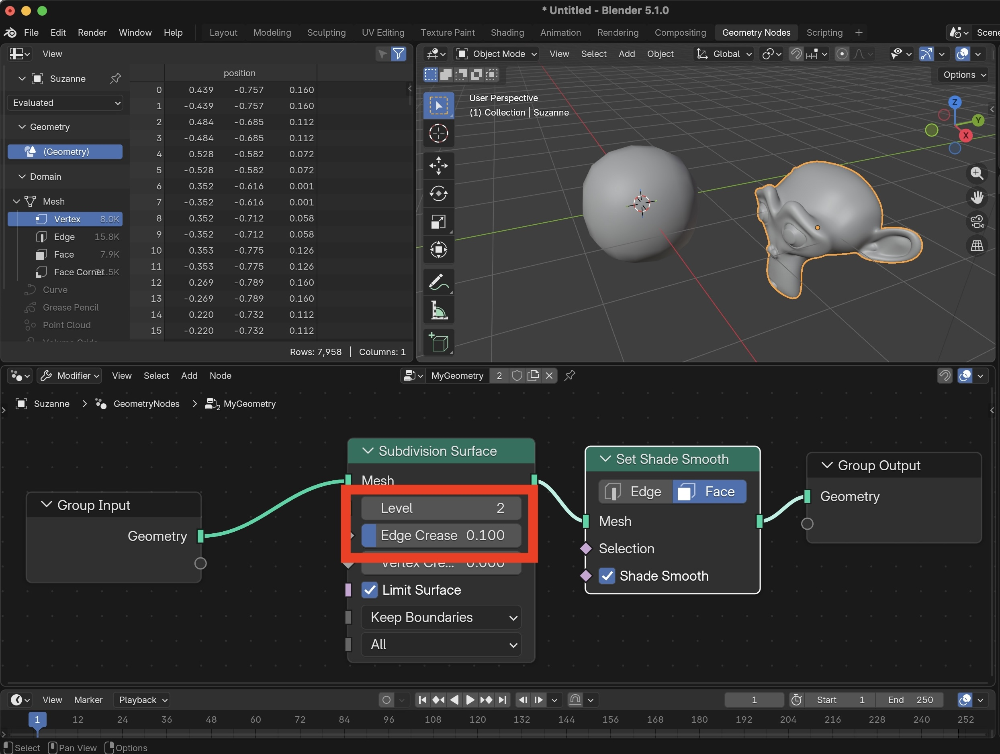
    <br>
    <em>Changing a GN modifier's property will affect all objects to which that modifier has been assigned.</em>
    <br>
    <br>
    <br>
</center>

