# Curve meshes

Curves are useful ways to model long, irregular shapes like branches and vines. 

By default curves are not rendered because curves have zero surface area (i.e., they do not have any mesh faces). 

Geometry nodes can be used to convert curves to meshes.

This mini-tutorial explains:

- how to create curves
- how to use geometry nodes to convert curves to meshes

<br>
<br>

# Create a curve

In the 3D Viewport click on the Z axis button to change the view to the XY plane.

<center>
    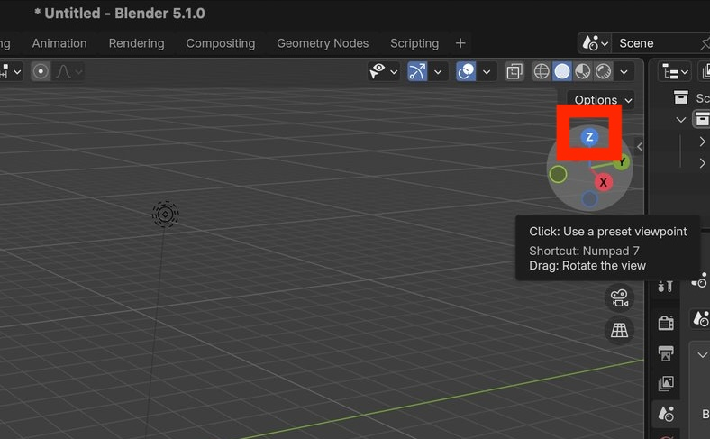
    <br>
  	<br>
  	<br>
</center>


Create a curve by selecting:

```
Add.. Curve.. Bezier
```


<center>
    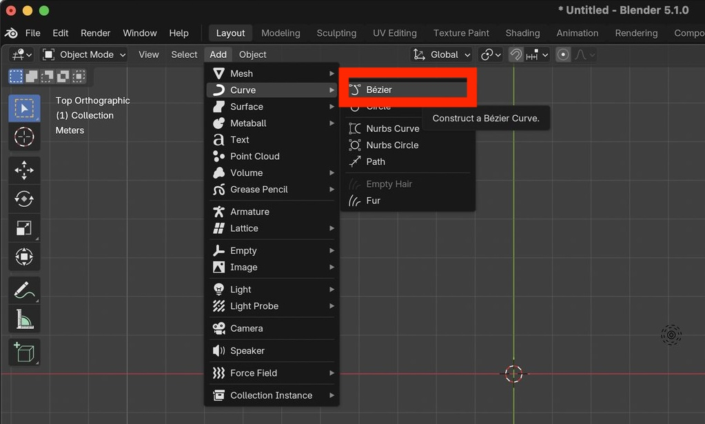
    <br>
    <br>
    <br>
</center>


The added curve will look like this:

<center>
    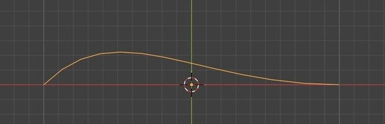
    <br>
    <br>
    <br>
</center>


# Edit the curve

Change from Object Mode to Edit Mode.


<center>
    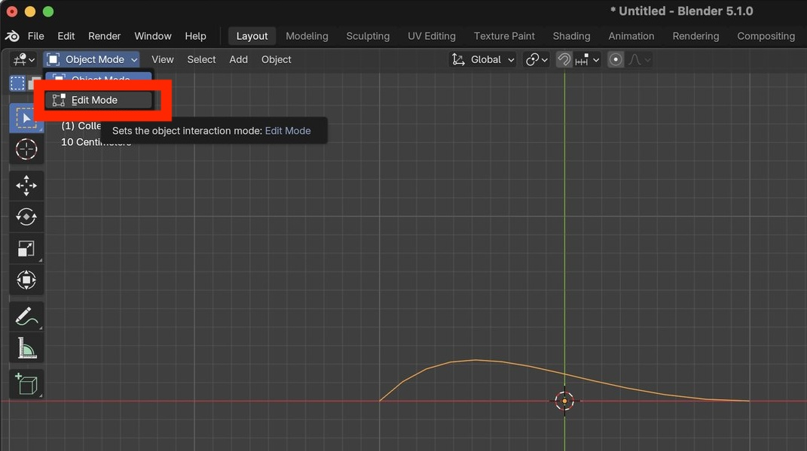
    <br>
    <br>
    <br>
</center>


Once in Edit Mode, left-click on the rightmost point to select it.


<center>
    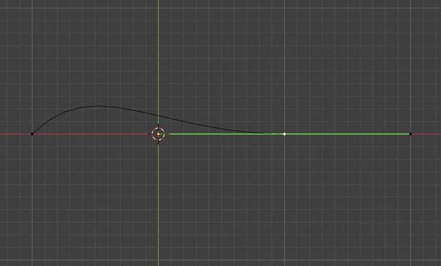
    <br>
    <br>
    <br>
</center>


Press the <kbd>E</kbd> key to extract the curve, drag the mouse to a new location and press the  <kbd>ENTER</kbd> key to create a new point.

<center>
    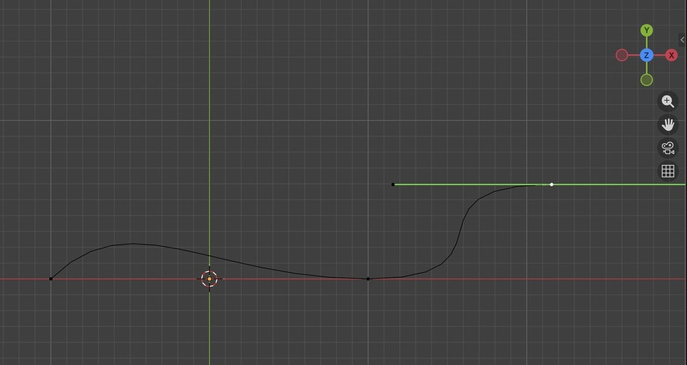
    <br>
    <br>
    <br>
</center>


Repeat the step above to create a fourth curve point.


Press the <kbd>R</kbd> key to rotate the selected curve point, drag the mouse and press the <kbd>ENTER</kbd> key to apply the rotation.

Note that rotating a curve point affects the overall curve shape.

<center>
    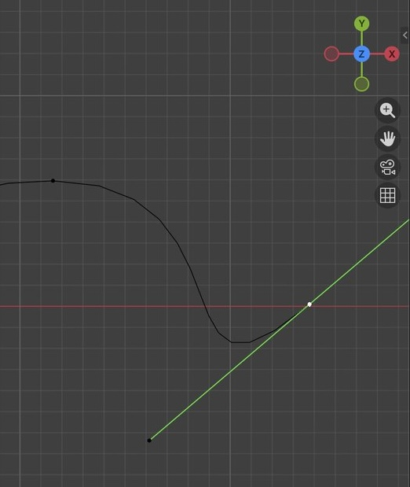
    <br>
    <br>
    <br>
</center>


Repeat for the other curve points so that all curve points are rotated in different directions.

<center>
    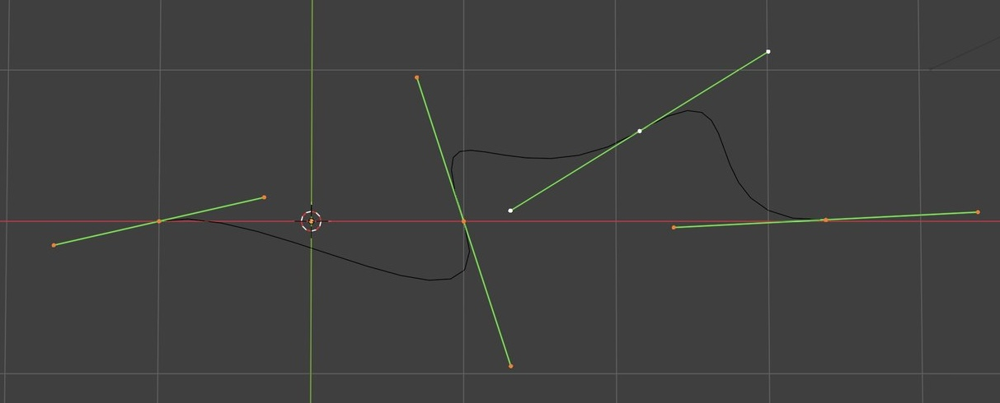
    <br>
    <br>
    <br>
</center>


Press the Y axis button to change the view to the XZ plane. 

Note that the curve appears to be a straight line in the XZ plane.

<center>
    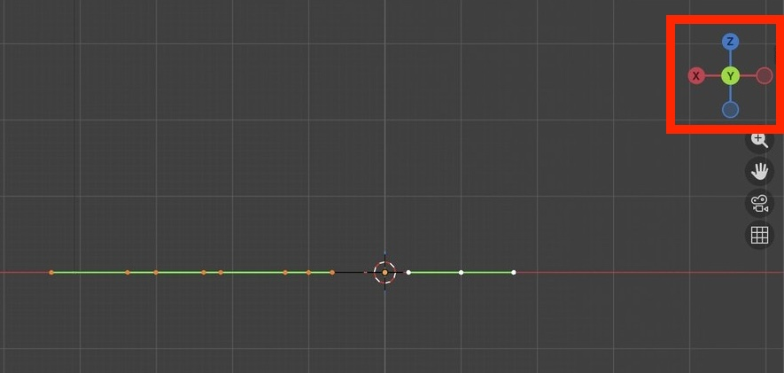
    <br>
    <br>
    <br>
</center>

Similar to above, rotate each of the curve points in the XZ plane.

<center>
    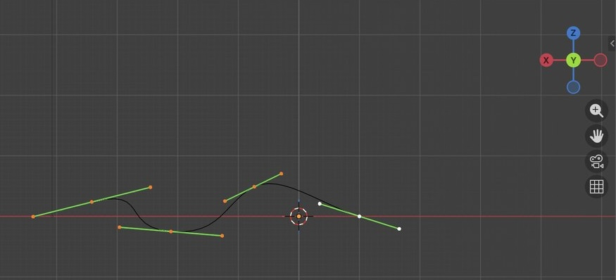
    <br>
    <br>
    <br>
</center>


Return to Object Mode.

Rotate the 3D Viewport view to view the curve in three dimensions.

Note that the curve has a relatively irregular, random-like 3D shape.

<center>
    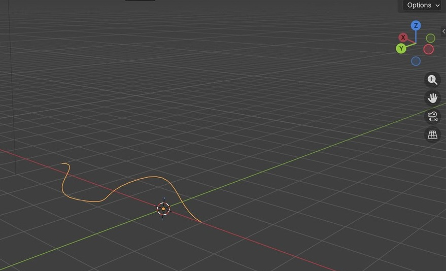
    <br>
    <br>
    <br>
</center>

# Transform the curve

The transform goals are to make the curve:

- start at the origin (0, 0, 0)
- point approximately in the vertical (Z) direction
- have a length of about 0.5 to 1 m

Ensure that you are in Object Mode (not Edit Mode).

Press the X axis button to view the YZ plane.

Press the <kbd>R</kbd> key to rotate the curve around the X axis until it is approximately vertical.


<center>
    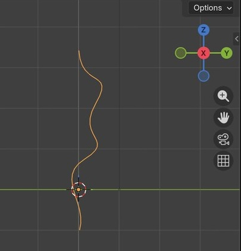
    <br>
    <br>
    <br>
</center>

Repeat for the XZ plane:

Press the Y axis button to view the XZ plane.

Press the <kbd>R</kbd> key to rotate the curve around the Y axis until it is approximately vertical.


<center>
    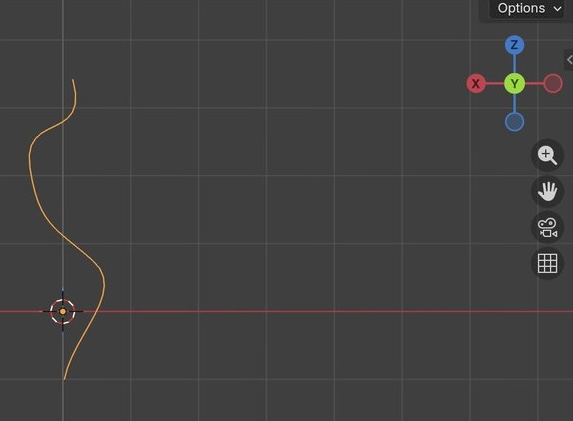
    <br>
    <br>
    <br>
</center>


Press the X axis button to view the YZ plane.

Press the <kbd>G</kbd> key to translate the curve in the YZ plane until the start of the curve is approximately at the global origin (0,0,0).

<center>
    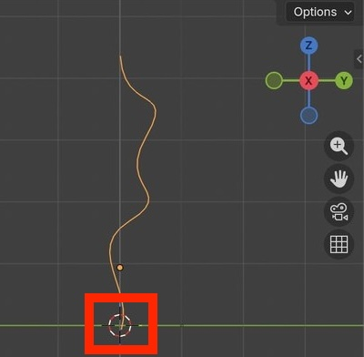
    <br>
    <br>
    <br>
</center>


Repeat for the XZ plane.

<center>
    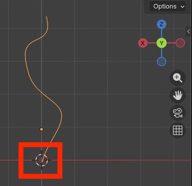
    <br>
    <br>
    <br>
</center>


Press the <kbd>N</kbd> key to open the side panel.

Note that some of the locations and rotations are non-zero.

<center>
    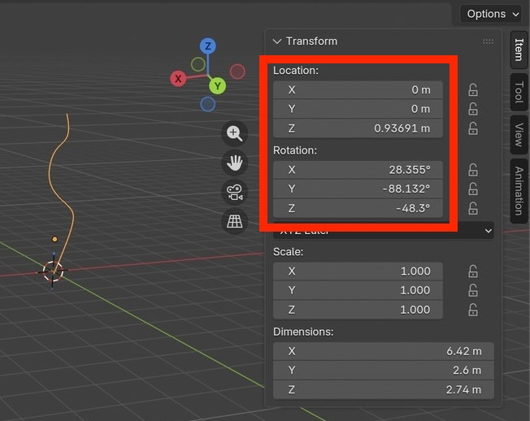
    <br>
    <br>
    <br>
</center>


Apply the current transformation by selecting:

```
Object.. Apply.. All Transforms
```


<center>
    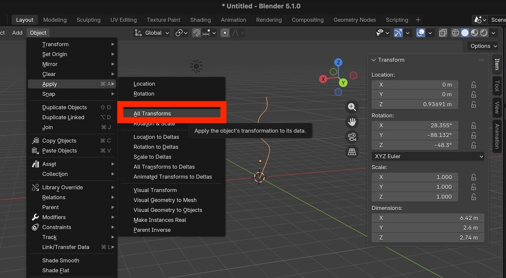
    <br>
    <br>
    <br>
</center>


After applying the transform, note that the locations and rotations are all now zero.

<center>
    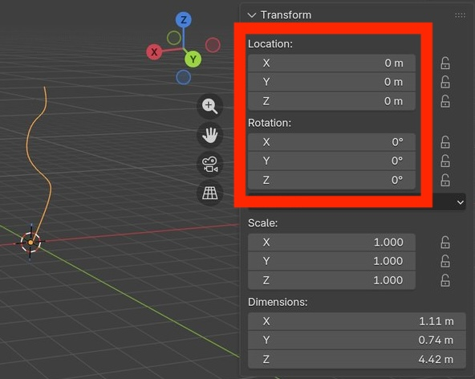
    <br>
    <br>
    <br>
</center>


The curve in the screenshot above is quite long, approximately 6 m.

Press the <kbd>S</kbd> key and drag the mouse down to scale the curve down until it is approximately 0.5 to 1 m long.

Note that the scale is now no longer 1.

<center>
    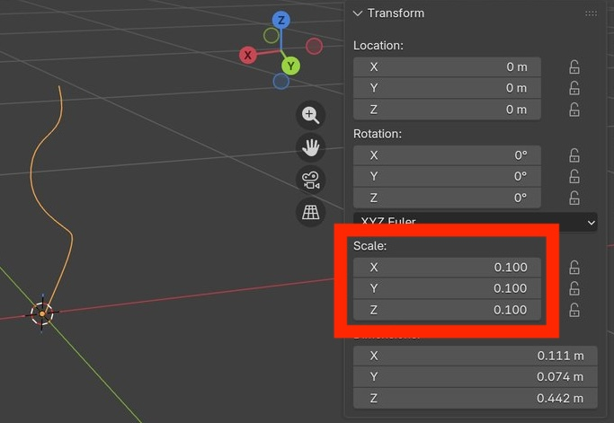
    <br>
    <br>
    <br>
</center>


Apply the scale transform by selecting:

```
Object.. Apply.. Scale
```


Note that the scale is now 1.

<center>
    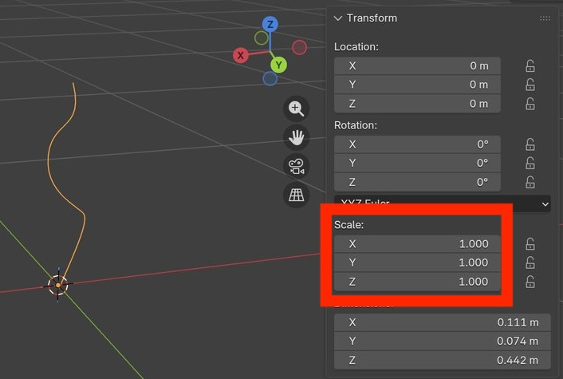
    <br>
    <br>
    <br>
</center>


# Convert to mesh

The following steps will produce a curve mesh as depicted in the screenshot below:

- Go into the Geometry Nodes workspace.

- Create a new Geometry Nodes modifier.

- Add a `Curve to Mesh` node by selecting:

```
Add.. Curve.. Operations.. Curve to Mesh
```

- Connect the `Group Input` node to the "Curve" input of the `Curve to Mesh` node.
- Connect the "Mesh" output of the `Curve to Mesh` node to the `Group Output`.
- Create curve thickness by adding a `Curve Circle` node:

```
Add.. Curve.. Primitives.. Curve Circle
```

- Connect the `Curve Circle` output to the "Profile Curve" input of the `Curve to Mesh` node.
- Set the `Curve Circle` node parameters:
    - Resolution = 8
    - Radius = 0.005
- Adjust the Radius parameter until the curve mesh looks approximately like a vine or branch.

<br>


<center>
    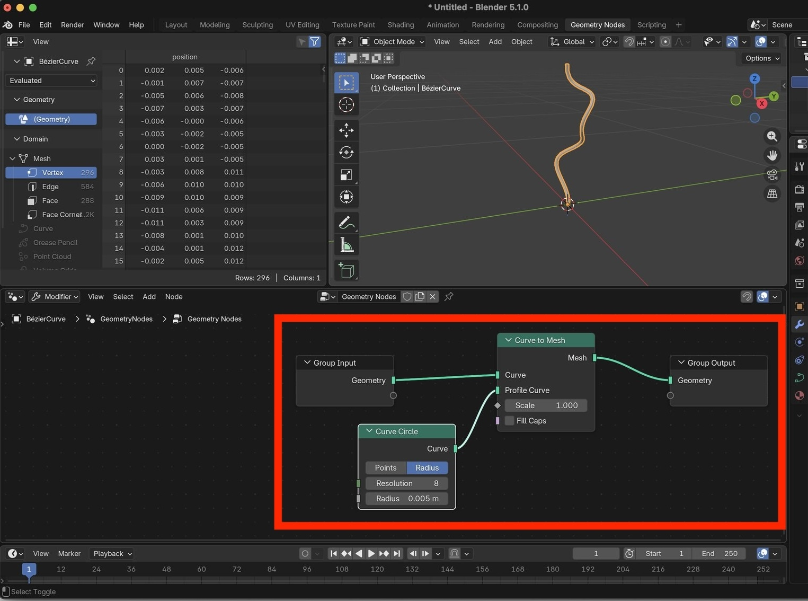
    <br>
    <br>
    <br>
</center>


