# Leaves

This mini-tutorial adds leaves to the previously created vine (or branch).

This mini-tutorial uses the leaf object in the attached "leaf.blend" file.

To download the "leaf.blend" file, right-click on [this link](leaf.blend) and select "Save link as" or "Save target as".

If you wish to create your own leaf geometry, refer to [this tutorial](https://www.youtube.com/watch?v=ZyW8Dmv97TU&list=PLsGl9GczcgBsDZ3jQPwP1p6evNI22wevP&index=2&t=1m20s)

<br>

# Append leaf object


Start from the end of the previous [curve mesh](3_curves.md) tutorial.

Ensure that you are in Object mode and that you can see a curve mesh in the 3D Viewport.


<center>
    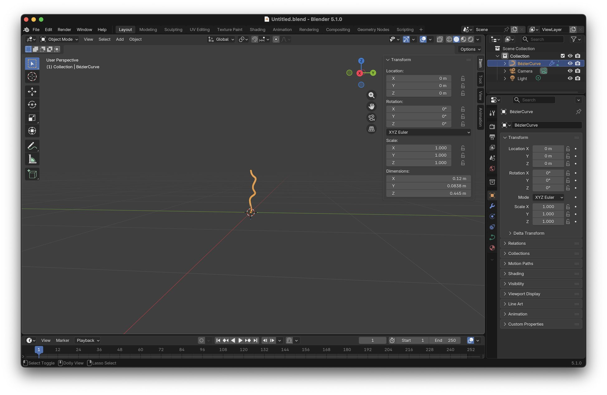
    <br>
    <br>
    <br>
</center>

From the main File menu select:

```
File.. Append
```

<center>
    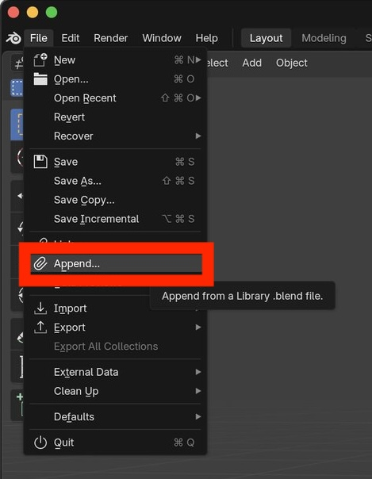
    <br>
    <br>
    <br>
</center>

In the pop-up file dialog:

Double-click on the downloaded "leaf.blend" file to view its contents.


<center>
    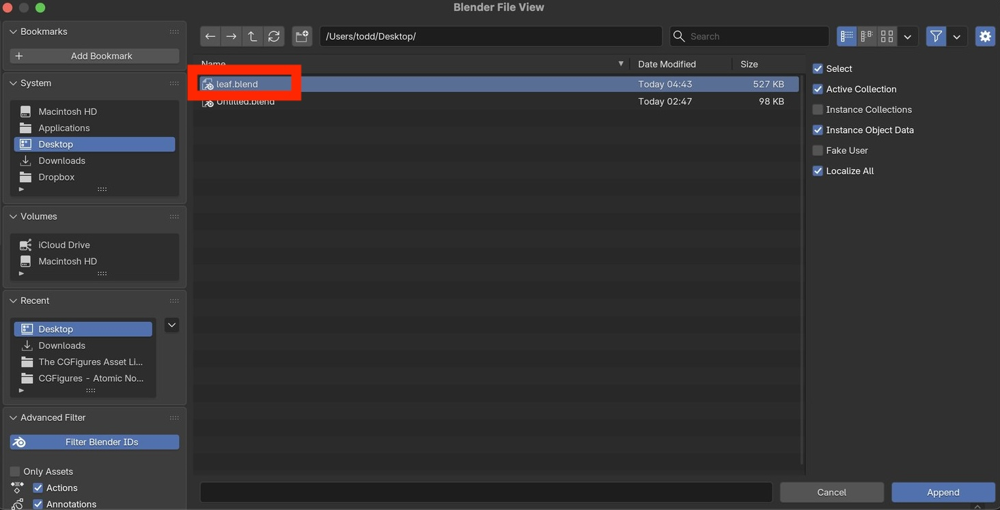
    <br>
    <br>
    <br>
</center>


Double-click on the Object folder to view the objects contained in the "leaf.blend" file.

<center>
    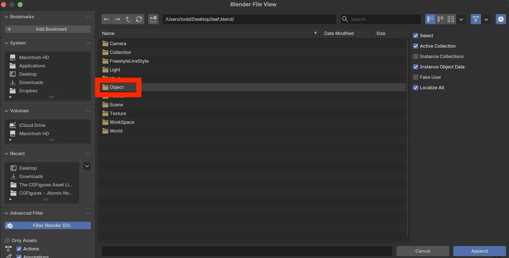
    <br>
    <br>
    <br>
</center>

Select the Leaf object.

Press the "Append" button to add the Leaf object to the current Blender file.


<center>
    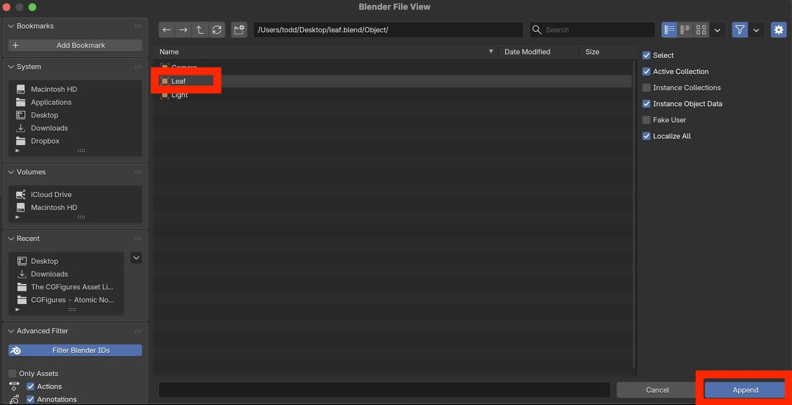
    <br>
    <br>
    <br>
</center>


Confirm that you can see the leaf object in the 3D viewport.

Also confirm that you can see the Leaf object in the Scene Collection (top-right).

<center>
    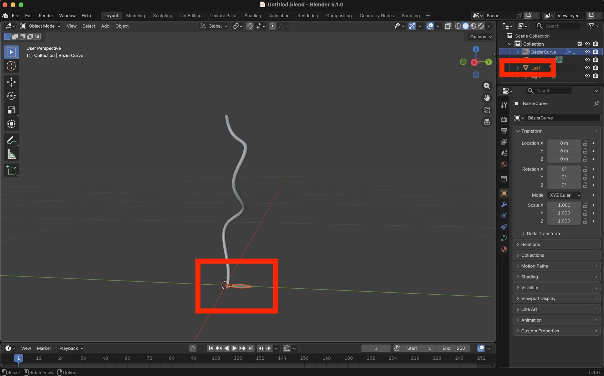
    <br>
    <br>
    <br>
</center>


# Add multiple leaves

Open the Geometry Nodes workspace.

Select the vine (curve mesh) object and verify that it has geometry nodes.

In the Scene Collection (top right), left-click on the Leaf object's eye and camera icons. 

- Toggling the eye icon will show/hide the Leaf in the 3D Viewport
- Toggling the camera icon will show/hide the Leaf in renderings.

<center>
    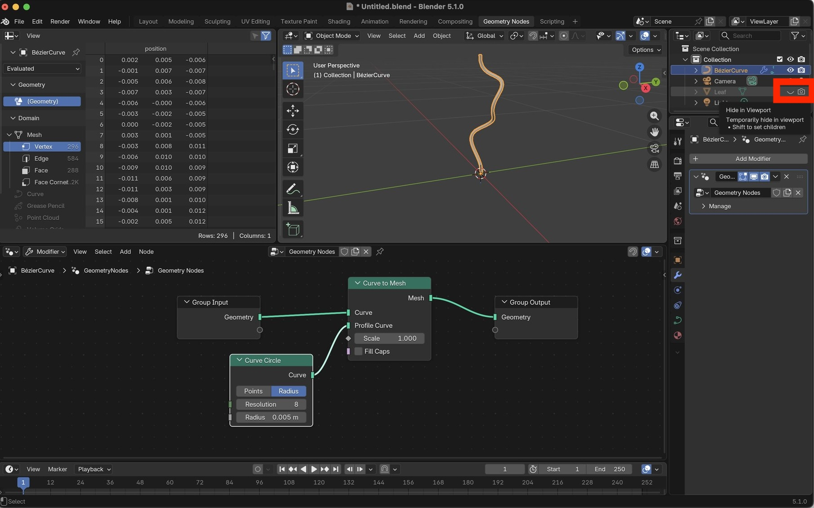
    <br>
    <br>
    <br>
</center>

In the Geometry Nodes Editor, add an `Object Info` node:

```
Add.. Input.. Scene.. Object Info
```

Left-click on the "Object" property.


<center>
    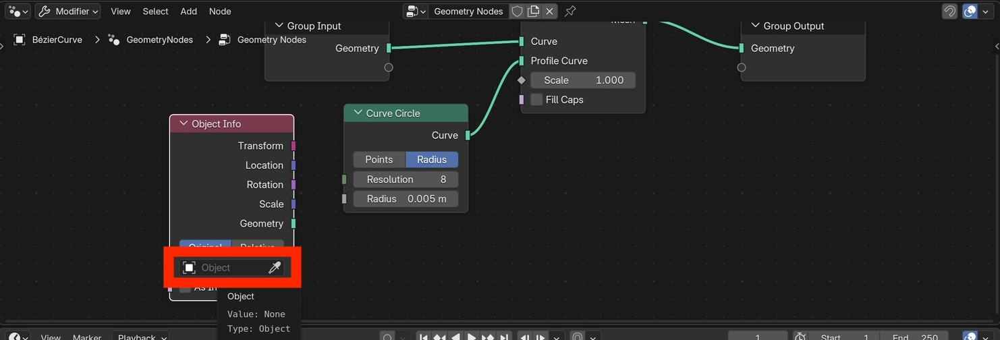
    <br>
    <br>
    <br>
</center>


Select the Leaf object.


<center>
    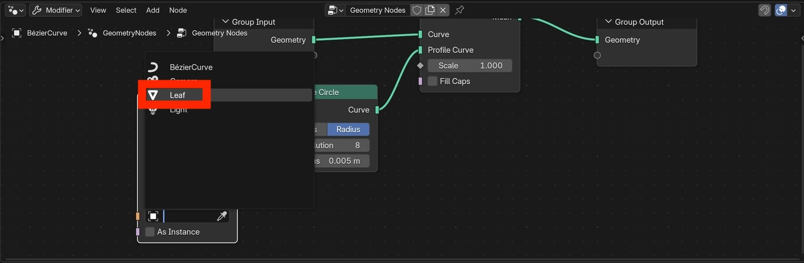
    <br>
    <br>
    <br>
</center>

Add an `Instance on Points` node.

```
Add.. Instances.. Instance on Points
```

- Connect `CurveToMesh.Mesh` to `InstanceOnPoints.Mesh`
- Connect `ObjectInfo.Geometry` to `InstanceOnPoints.Instance`
- Connect `InstanceOnPoints.Instances` to the output geometry.

Verify that you can now see many leaves along the previously defined curve.


<center>
    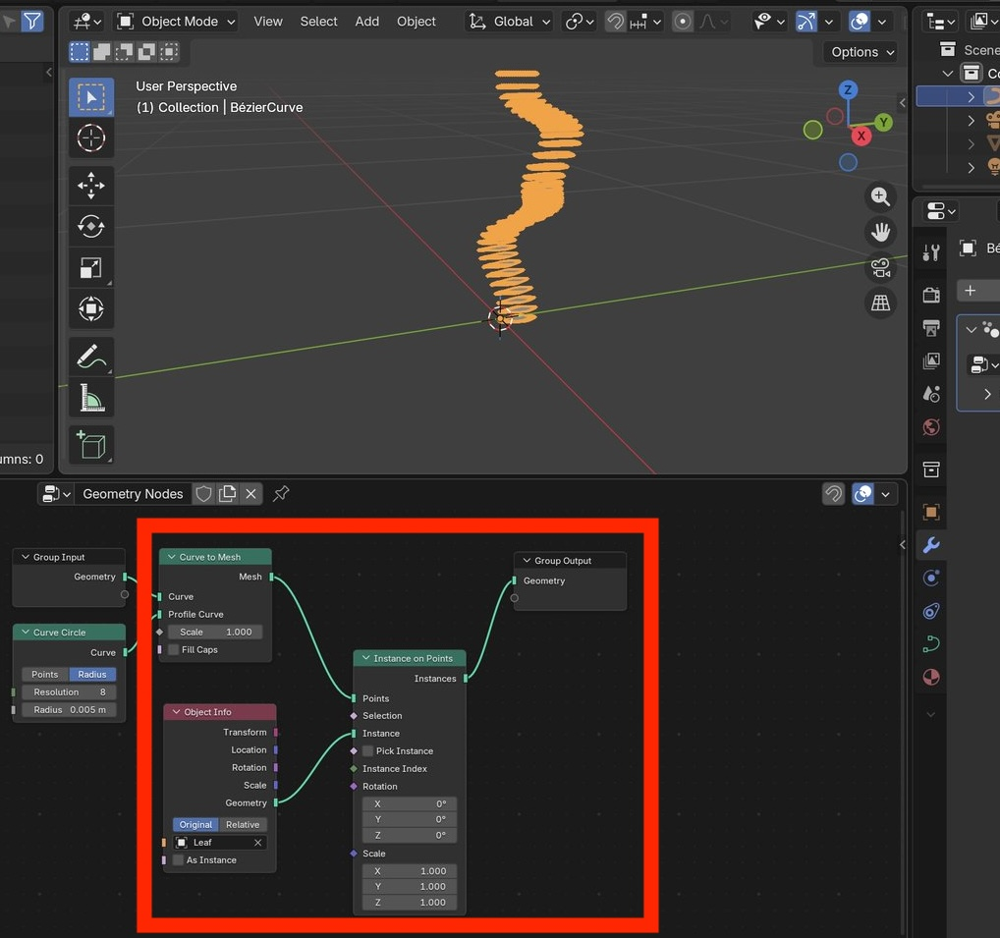
    <br>
    <br>
    <br>
</center>


# Randomize leaf positions

The leaves in the screenshot above are evenly spaced along the curve. It is usually preferable to randomly distribute objects.  To randomly distribute the leaves:

Add a `Distribute Points on Faces` node:

```
Add.. Point.. Distribute Points on Faces
```

- Connect `CurveToMesh.Mesh` to `DistributePointsOnFaces.Mesh`
- Connect `DistributePointsOnFaces.Points` to `InstanceOnPoint.Points`

Adjust the random distribution properties:

- Change the random type from Random to Poisson Disk
- Distance Min = 0.01 m
- Density = 1000

Optionally change these values according to your preferred leaf density.


<center>
    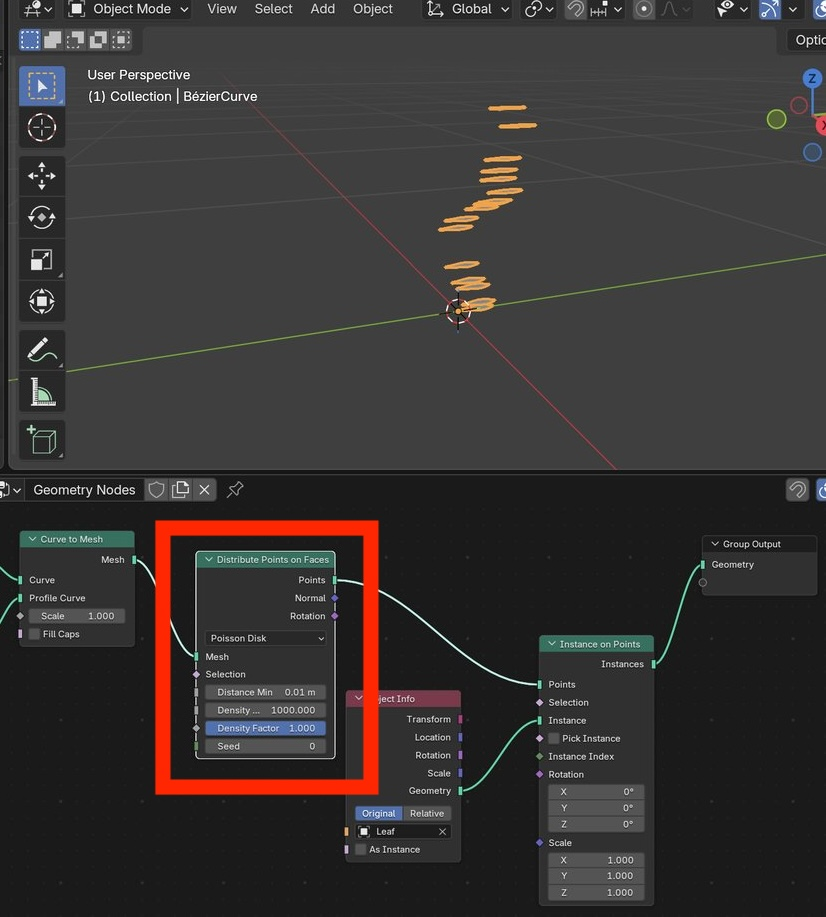
    <br>
    <br>
    <br>
</center>


Change the "Seed" value to see different leaf position randomizations.


<center>
    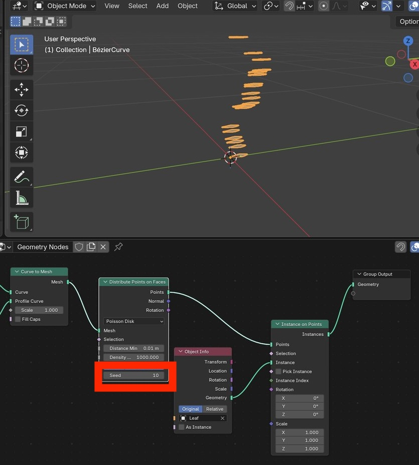
    <br>
    <br>
    <br>
</center>


# Randomize leaf rotations

The leaf instances are currently all pointing in the same direction.

To randomly rotate the leaves:

- Add a `Random Value` node:

```
Add.. Utilities.. Random Value
```


<center>
    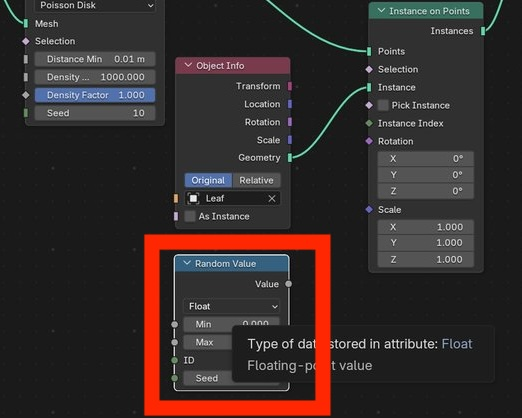
    <br>
    <br>
    <br>
</center>


> [!NOTE]
> Rotation units are radians

- Change the `Random Value` type from "Float" to "Vector"
- Connect `RandomValue.Value` to `InstanceOnPoints.Rotation`
- Adjust the Z rotation range to (0, 6.28)  (i.e., Min=0, Max=6.28) (i.e., 0 to 360 deg)


<center>
    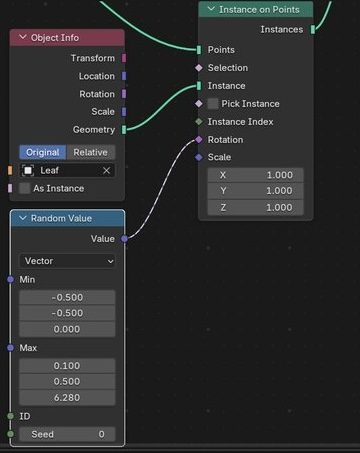
    <br>
    <br>
    <br>
</center>


<center>
    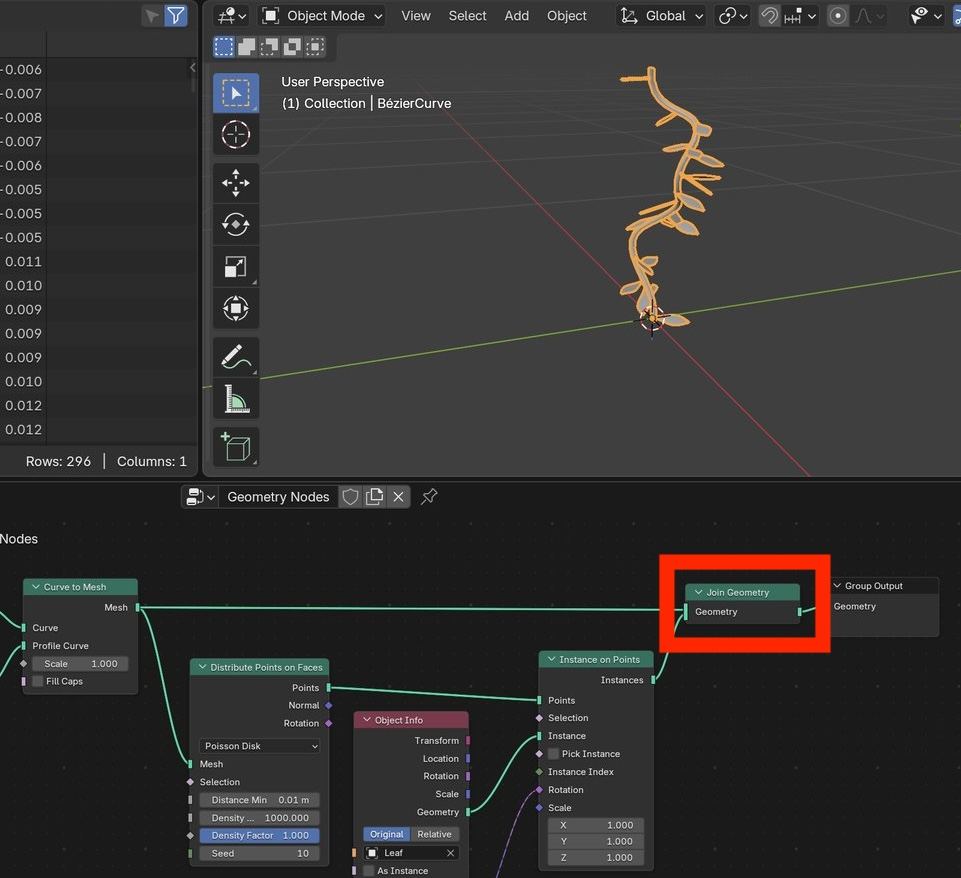
    <br>
    <br>
    <br>
</center>


<center>
    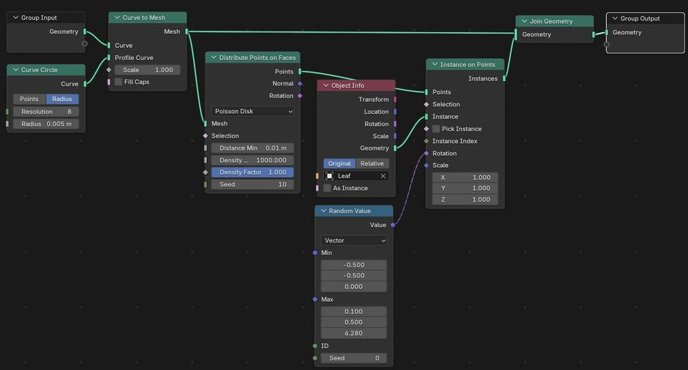
    <br>
    <br>
    <br>
</center>


<center>
    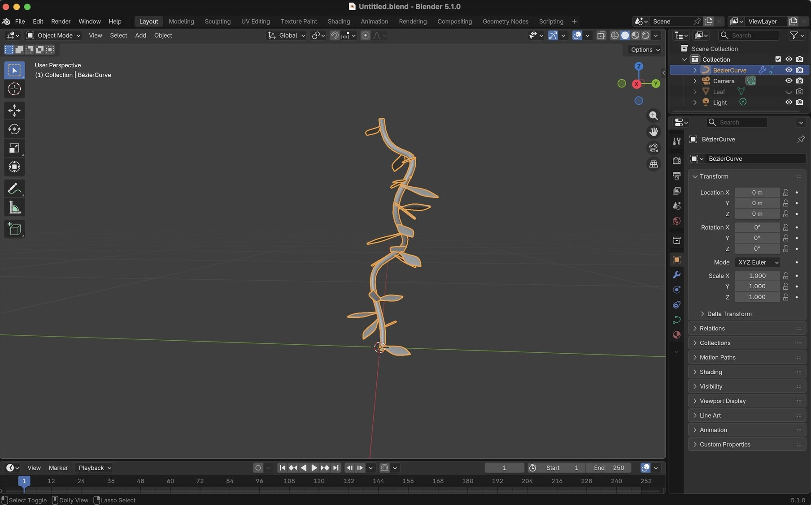
    <br>
    <br>
    <br>
</center>


