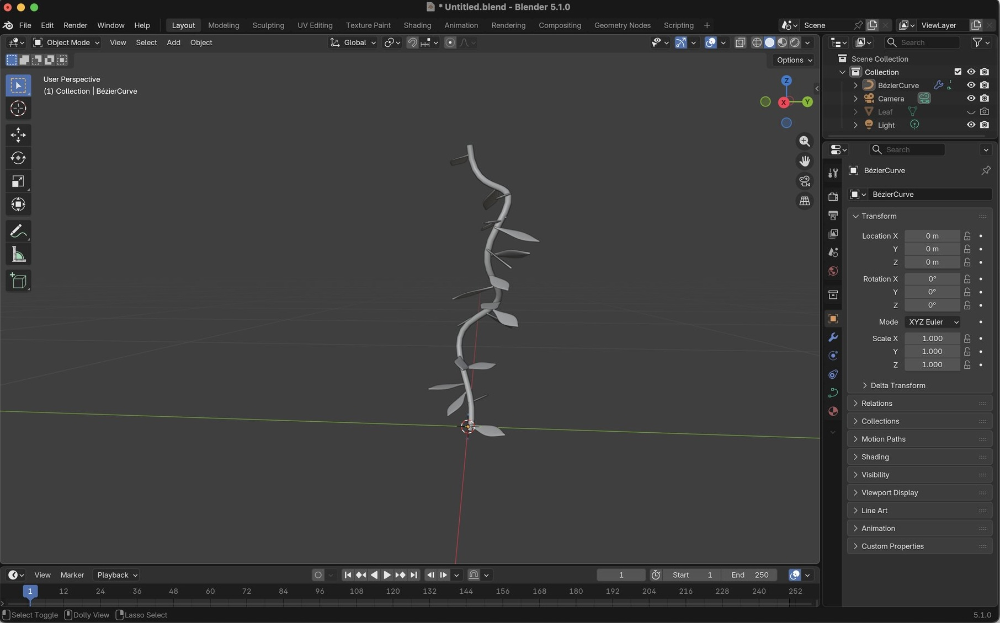
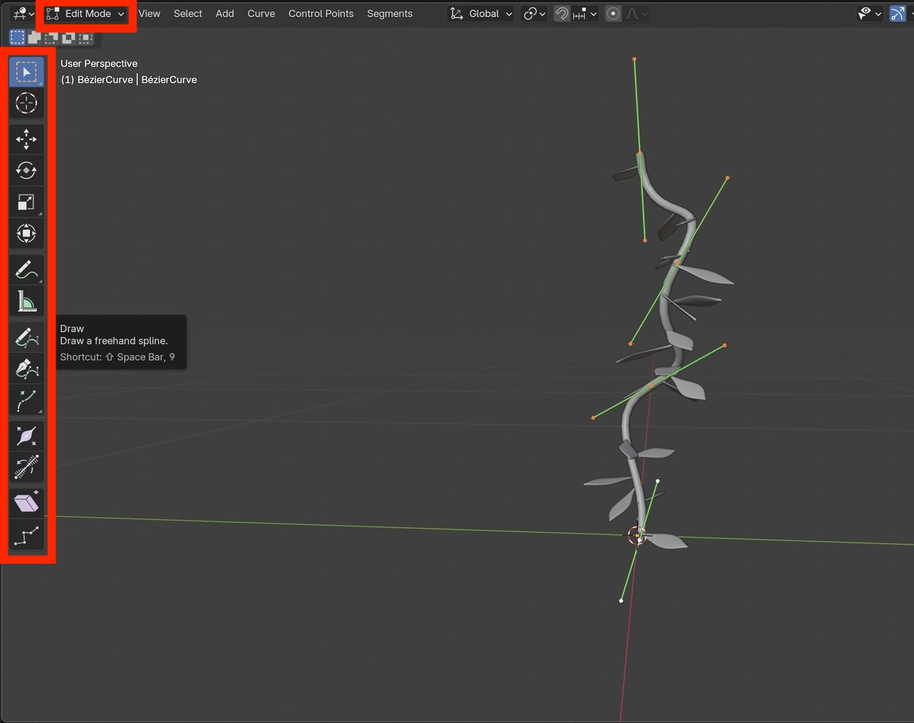
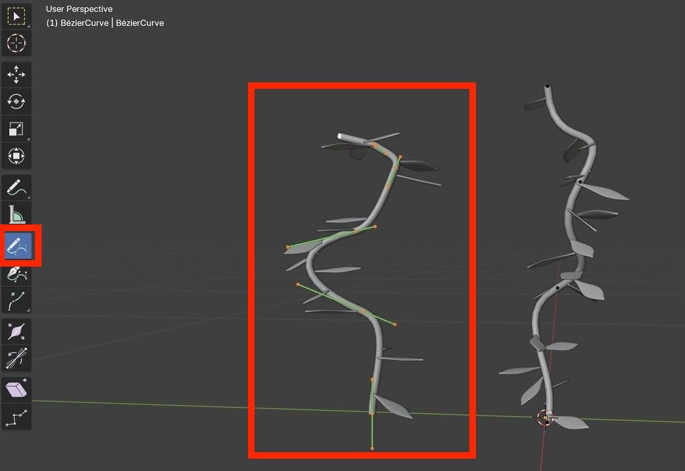
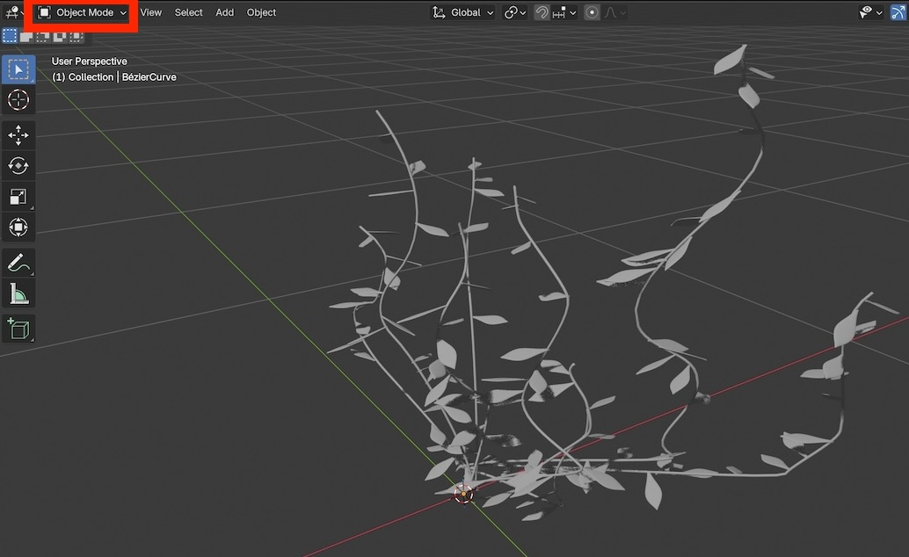
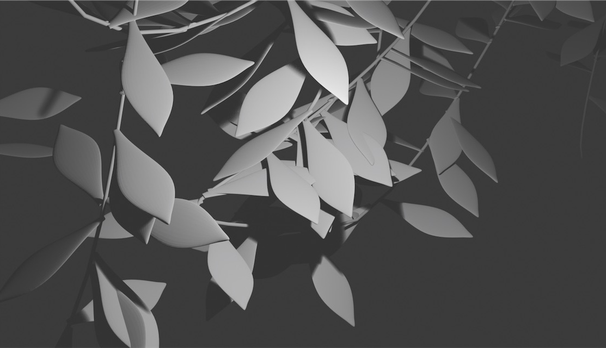

# Draw new vines / branches

This mini-tutorial draws new vines branches using the previously created geometry nodes.

Starting from the previous [leaves tutorial](4_leaves.md), your model should look similar to this:

    
     
     
     

 

# Enable draw

Change from Object Mode to Edit Mode.

Press the <kbd>T</kbd> key to toggle the left-hand toolbar on.

    
     
     
     

Activate the Draw tool;  it is about halfway down the toolbar.

Left click on the 3D Viewport and drag the mouse around to freely sketch a new curve.

When you release the mouse a new vine / branch will appear, and the leaves will have new random positions and rotations.

    
     
     
     

Draw several more vines / branches.

After drawing you can optionally move individual curves or curve points to new locations.

Optionally adjust various geometry nodes parameters like the curve thickness and leaf density.

After drawing and moving several new vines / branches the result will look something like this:

    
     
     
     

Moving the camera close to the leaves and rendering will result in an image like this:

    
     

 
 
 

