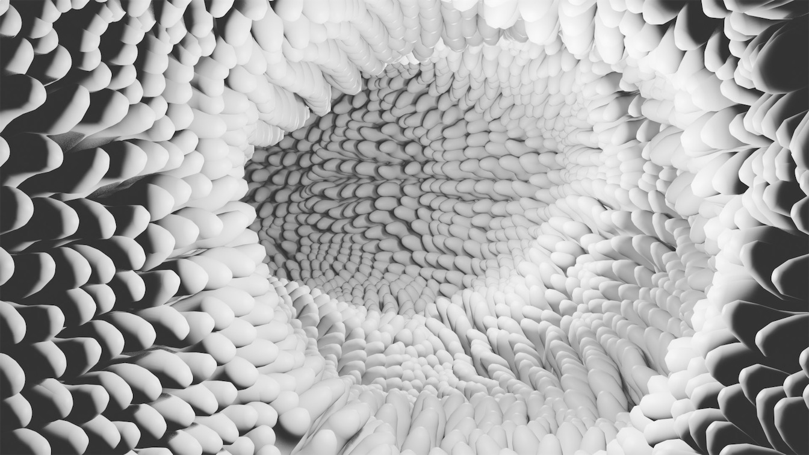

Lesson Overview

# Microvilli

This tutorial describes how to use particle systems to create a microvilli visualization in Blender.  It is a simplified version of the [How to Make Microvilli in Blender]( https://www.youtube.com/watch?v=Y-xaKxRn4es ) tutorial.

The final goal of this tutorial is to produce a visualization similar to this one:

    
     
     
		 

