# Single microvilli models

This mini-tutorial explains how to create single microvilli models from basic cylinder geometry.

<br>

# Create base geometry

Create a basic cylinder mesh by selecting:

```
Add.. Mesh.. Cylinder
```


<center>
    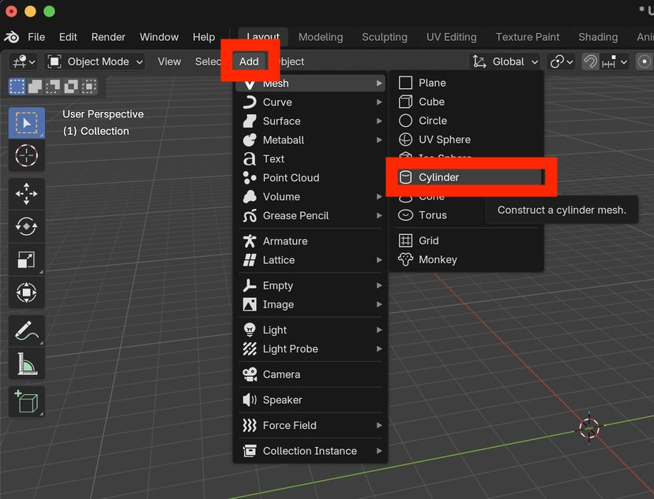
    <br>
    <br>
    <br>
</center>

Scale the cylinder:

- Press <kbd>S</kbd>  <kbd>Z</kbd> <kbd>2</kbd> to lengthen the cylinder in the Z direction.
- Press <kbd>S</kbd>  <kbd>X</kbd> <kbd>0.5</kbd> to shorten the cylinder in the X direction.
- Press <kbd>S</kbd>  <kbd>Y</kbd> <kbd>0.5</kbd> to shorten the cylinder in the Y direction.

The cylinder should now of an (X,Y,Z) scale of (0.5, 0.5, 2).


<center>
    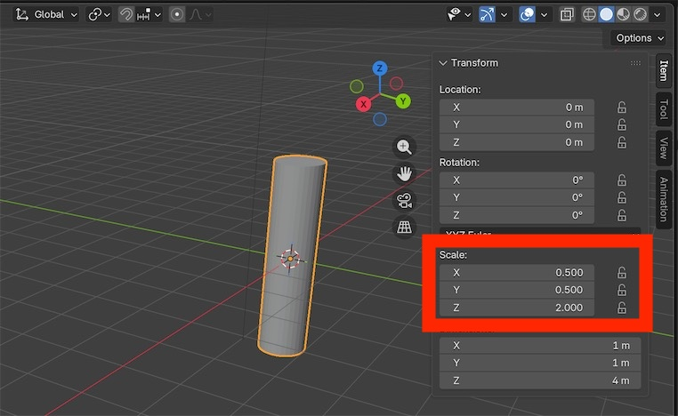
    <br>
    <br>
    <br>
</center>
Apply the scale transforms by selecting:

```
Object.. Apply.. All Transforms
```


Verify that the (X, Y, Z) scale is now (1,1,1)


<center>
    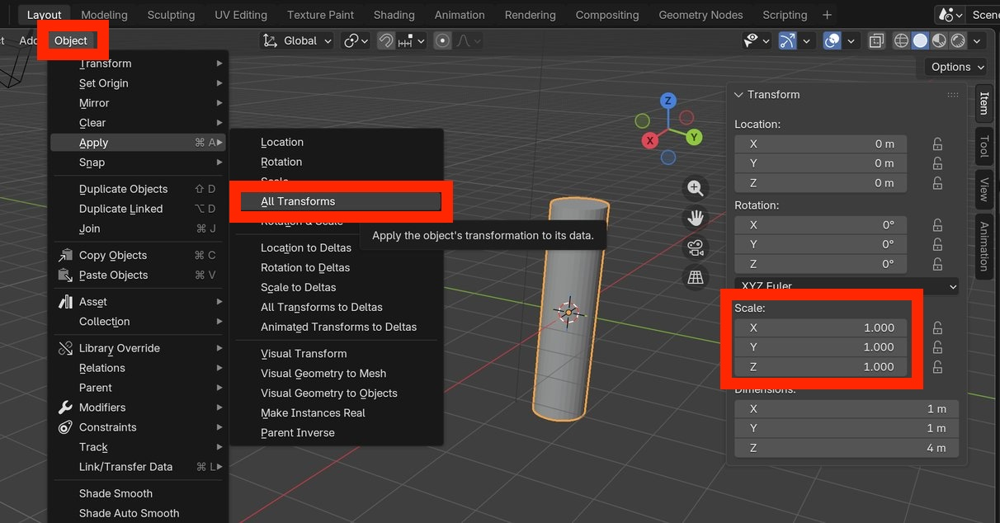
    <br>
    <br>
    <br>
</center>
Move the cylinder to the origin:

- Enter Edit Mode.
- Click on the X navigation axis to enter the YZ view.
- Type <kbd>A</kbd> to select all vertices.
- Type <kbd>G</kbd>  <kbd>Z</kbd> <kbd>2</kbd> to move the cylinder upward so that its base is at Z=0


<center>
    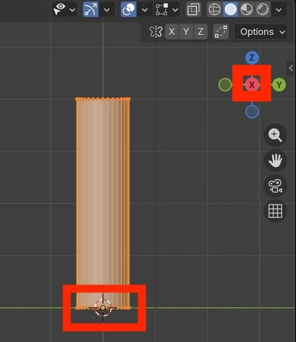
    <br>
    <br>
    <br>
</center>


Add more vertices in the Z direction using loop cuts...

- Hover the mouse over the cylinder
- Type <kbd>CTRL</kbd> <kbd>R</kbd> to create a temporary loop cut

<center>
    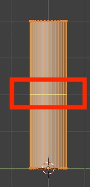
    <br>
    <br>
    <br>
</center>

Type <kbd>12</kbd> to create a total of 12 loop cuts.

Press <kbd>ENTER</kbd> and then <kbd>ENTER</kbd> again to apply the loop cuts.

<center>
    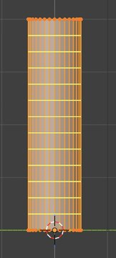
    <br>
    <br>
    <br>
</center>

Narrow the top face of the cylinder:

- (1)  Ensure that face select is enabled.
- (2)  Ensure that proportional editing is enabled.
- (3)  Select "Sharp" as the proportional editing tool.


<center>
    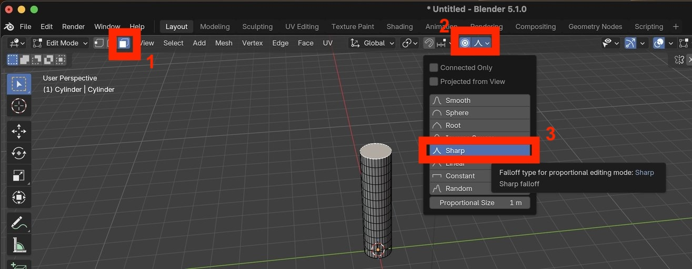
    <br>
    <br>
    <br>
</center>

Type <kbd>S</kbd> then <kbd>0.3</kbd> to scale the the top face.


<center>
    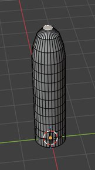
    <br>
    <br>
    <br>
</center>


Enter Object Mode

Right-click on the cylinder and select "Shade Smooth"


<center>
    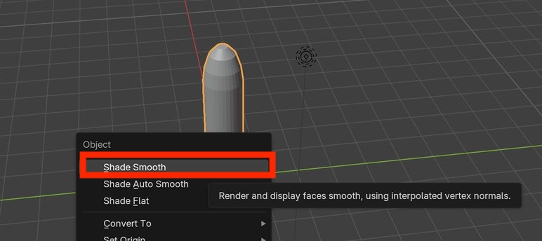
    <br>
    <br>
    <br>
</center>

Verify that the microvilli now appears smooth.

<center>
    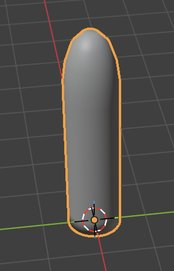
    <br>
    <br>
    <br>
</center>

# Add wiggle

Add some wiggle to the microvilli as follows:

- Enter Edit Mode
- (1) Ensure that Edge select is enabled
- (2) Ensure that Proportional Editing is enabled
- (3) Select "Smooth" as the proportional editing tool.
- (4) Press <kbd>ALT</kbd> and left-click on a horizontal edge to select the entire loop cut.

<center>
    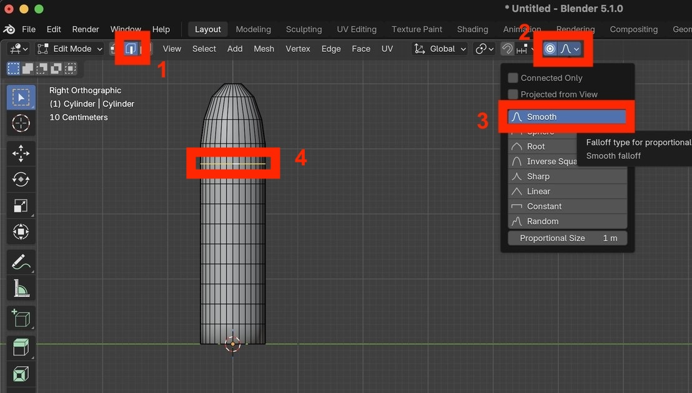
    <br>
    <br>
    <br>
</center>

Type <kbd>G</kbd> and move the mouse a little to the right, then press <kbd>ENTER</kbd> to apply the translation.

Repeat for another horizontal loop cut, this time moving to the left.

The microvilli should now look something look like this:

<center>
    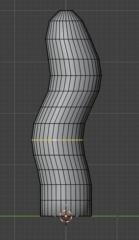
    <br>
    <br>
    <br>
</center>

# Replicate microvilli model

Enter Object Mode.

Type <kbd>SHIFT</kbd> <kbd>D</kbd> then <kbd>Y</kbd> <kbd>2</kbd> to duplicate the microvilli and move it 2 units in the Y direction.

Repeat this duplication step two more times so that there are now 4 identical microvilli.

<center>
    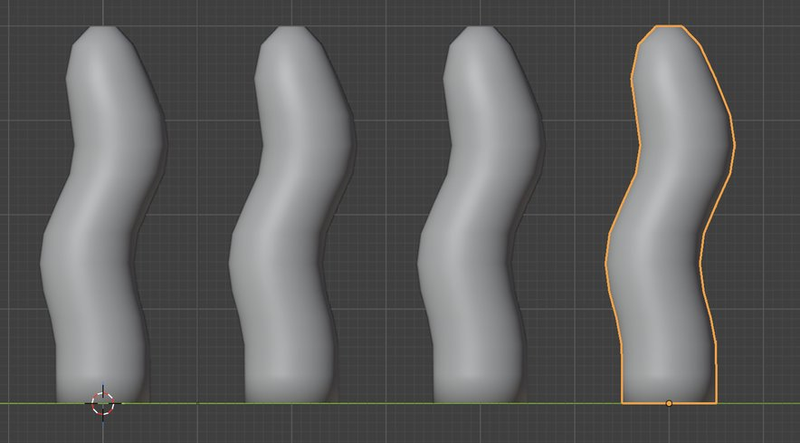
    <br>
    <br>
    <br>
</center>

# Add wiggle variation

For each of the three new microvilli:

- Go into Edit mode
- Select a loop cut and move it to a different location
- Select another loop cut and move it to a different location

Verify that the four microvilli are no longer identical.

<center>
    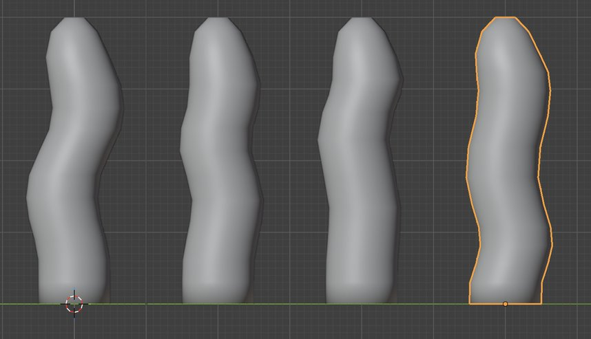
    <br>
    <br>
    <br>
</center>

Rotate the view so that you are no longer in the YZ plane.

Repeate the previous step, adding loop cut location variation for each microvilli separately.

Verify that the four microvilli now have relatively substantial variation from all view angles.


<center>
    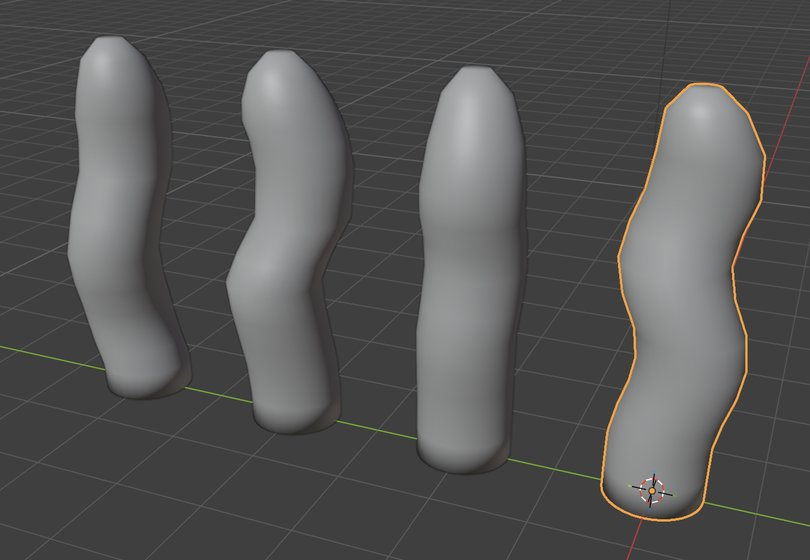
    <br>
    <br>
    <br>
</center>
# Flare microvilli base

To flare the base of one microvilli:

- Enter Edit Mode
- (1) Ensure that Edge select is enabled
- (2) Ensure that Proportional Editing is enabled
- (3) Select "Sharp" as the proportional editing tool.
- (4) Press <kbd>ALT</kbd> and left-click on the bottom edge to select the entire bottom ring.


<center>
    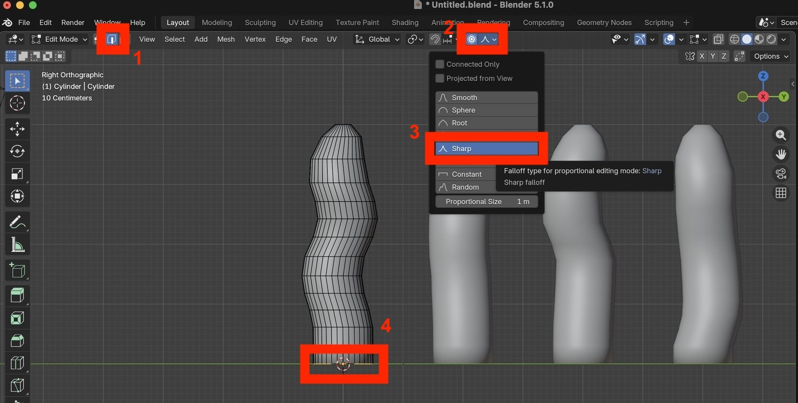
    <br>
    <br>
    <br>
</center>

Type <kbd>S</kbd> then drag the mouse outward to flare the base.

<center>
    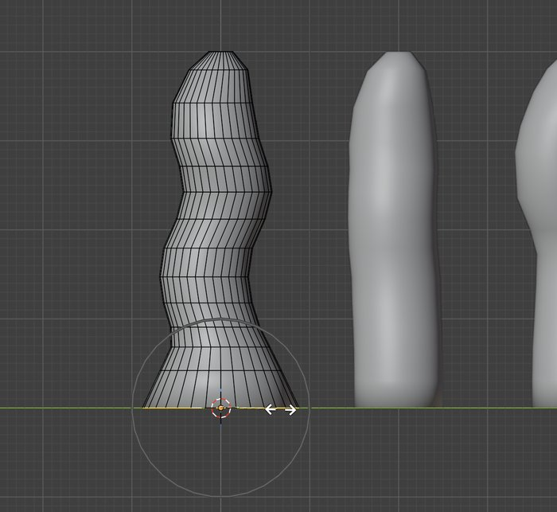
    <br>
    <br>
    <br>
</center>


Repeat for the other microvilli.

<center>
    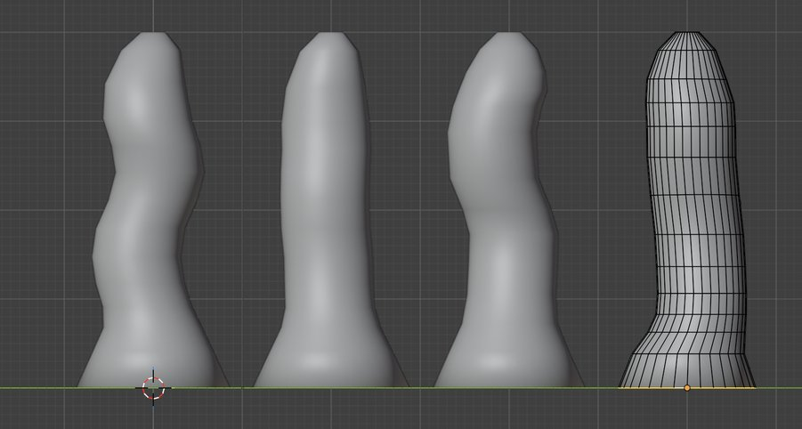
    <br>
    <br>
    <br>
</center>


# Organize microvilli objects

In the Scene Collection find the four micovilli (cylinder) objects.

<center>
    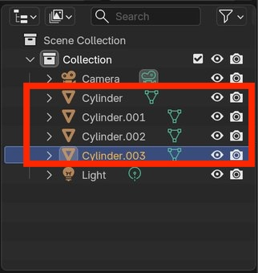
    <br>
    <br>
    <br>
</center>


Double click on the first object and change its name to "MV-1".

Repeat for the other three objects, naming them "MV-2", "MV-3" and "MV-4".


<center>
    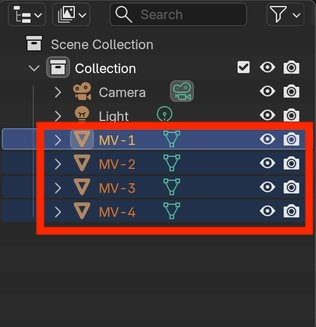
    <br>
    <br>
    <br>
</center>


Right-click on "Scene Collection" and select "New Collection" to create a new collection.

<center>
    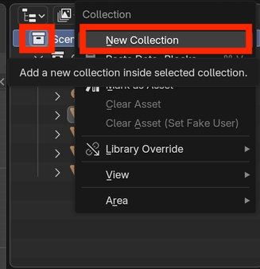
    <br>
    <br>
    <br>
</center>


Double-click on the new collection and change its name to "MV".

Drag all microvilli objects into the new collection.

<center>
    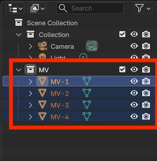
    <br>
    <br>
    <br>
</center>


Disable visualization and rendering by left-clicking on the eye and camera icons in the Scene Collection.

Verify that you no longer see the microvilli objects in the 3D Viewport.

<center>
    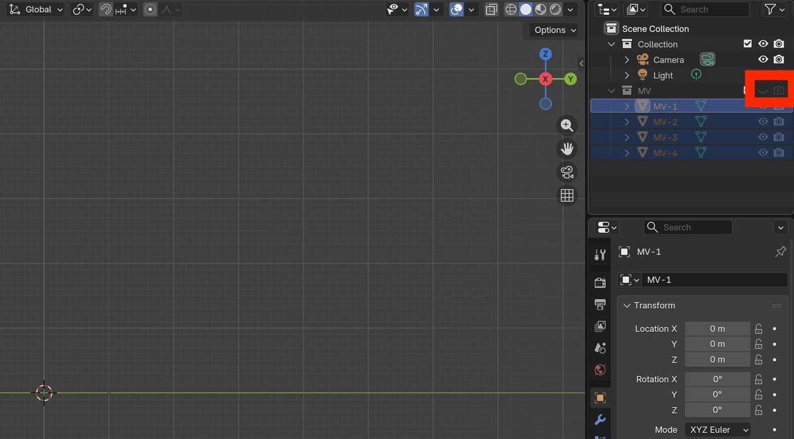
    <br>
    <br>
    <br>
</center>

