# Microvilli tube

This mini-tutorial explains how to create a tube from which microvilli will stem.

<br>

# Create base geometry

Create a basic cylinder mesh by selecting:

```
Add.. Mesh.. Cylinder
```


<center>
    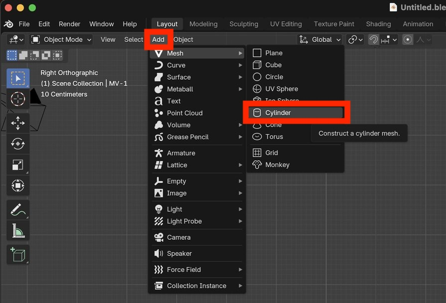
    <br>
    <br>
    <br>
</center>


WITHOUT deselecting the cylinder, click on the "Add Cylinder" dialog to expand it.

<center>
    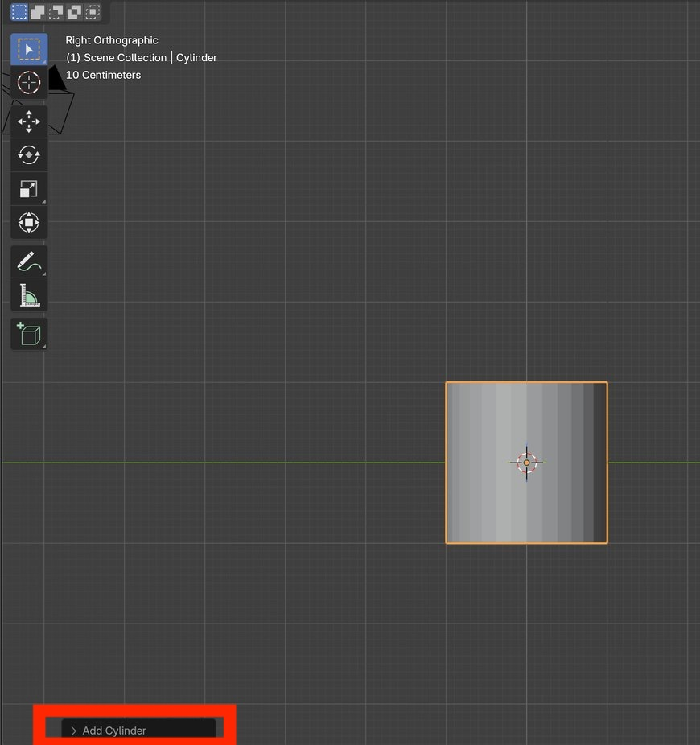
    <br>
    <br>
    <br>
</center>

Change the "Vertices" property to 64

<center>
    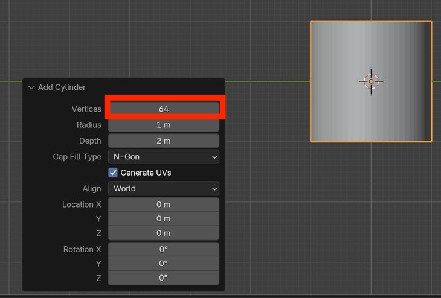
    <br>
    <br>
    <br>
</center>

Enter Edit Mode

Type <kbd>CTRL</kbd> <kbd>R</kbd> then <kbd>20</kbd> to generate 20 loop cuts.

Press <kbd>ENTER</kbd> then <kbd>ENTER</kbd> again to apply the loop cuts.

<center>
    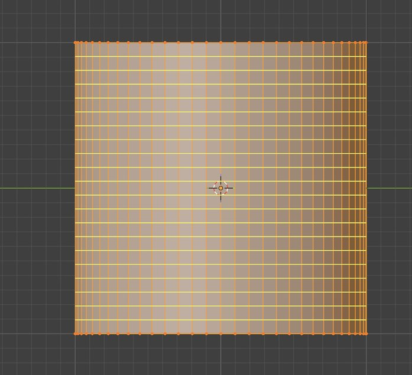
    <br>
    <br>
    <br>
</center>


Verify that there are now vertices for the new loop cuts.

<center>
    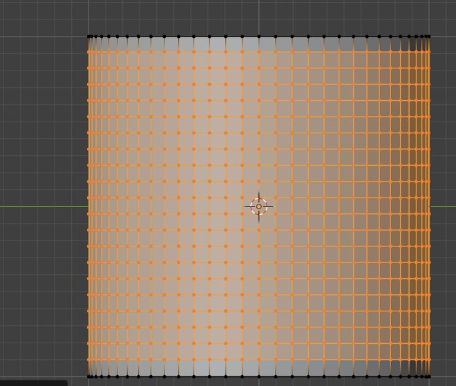
    <br>
    <br>
    <br>
</center>

Delete the top and bottom cylinder faces:

- Go into Edit Mode
- Ensure that face-select is enabled
- Select the top face and type <kbd>X</kbd>

<center>
    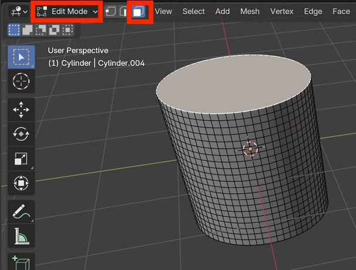
    <br>
    <br>
    <br>
</center>

Select "Faces"

<center>
    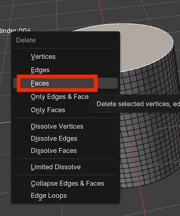
    <br>
    <br>
    <br>
</center>

Also delete the bottom face.

Verify that the cylinder is now tube-like, with no top or bottom face.

<center>
    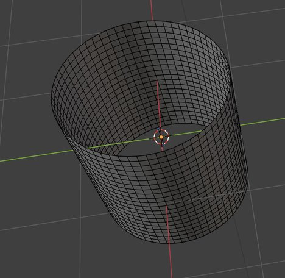
    <br>
    <br>
    <br>
</center>

# Prepare simple tube

Go into Object Mode.

Rotate the cylinder 90 deg around the X axis.

<center>
    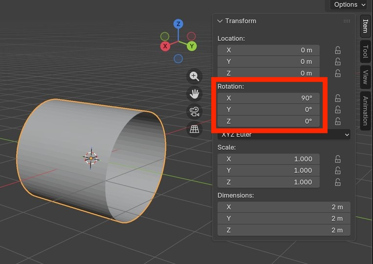
    <br>
    <br>
    <br>
</center>

Apply the rotation by selecting:

```
Object.. Apply.. Rotation
```

Verify that the XYZ rotations are now zero.


<center>
    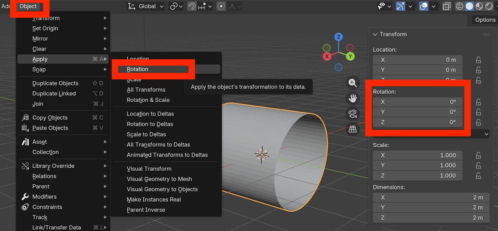
    <br>
    <br>
    <br>
</center>
Go to the Modifers panel.

Select "Add Modifier"

<center>
    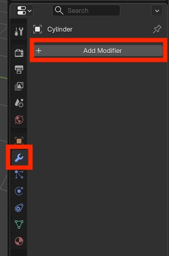
    <br>
    <br>
    <br>
</center>

Select the array modifier:

```
Add Modifier.. Generate.. Array
```


<center>
    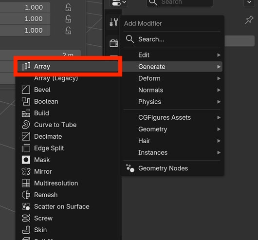
    <br>
    <br>
    <br>
</center>

Set the followinng Array modifier parameters:

- Count = 3
- Offset (X, Y, Z) = (0, 1, 0)
- Merge = True  (i.e., checked)

Verify that there is now a tube-like structure.

<center>
    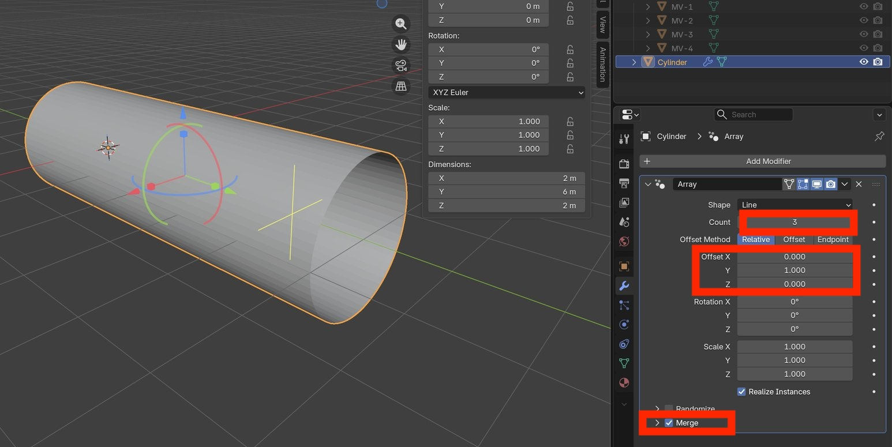
    <br>
    <br>
    <br>
</center>

# Create a modifier curve

Press the "Z" button on the navigation axes to enter the XY plane view.

Change the viewport shading to Wireframe.


<center>
    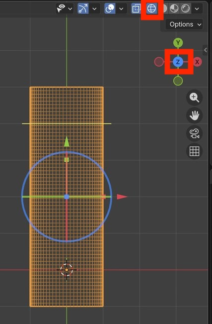
    <br>
    <br>
    <br>
</center>

Add a Bezier curve:

```
Add.. Curve.. Bezier
```


<center>
    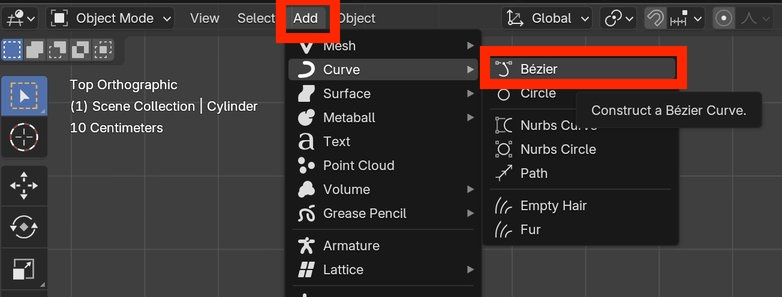
    <br>
    <br>
    <br>
</center>


Verify that the Bezier curve is selected.

<center>
    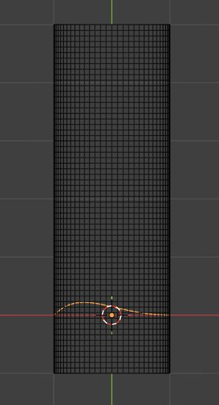
    <br>
    <br>
    <br>
</center>


Rotate the Bezier curve -90 deg around the Z axis.

<center>
    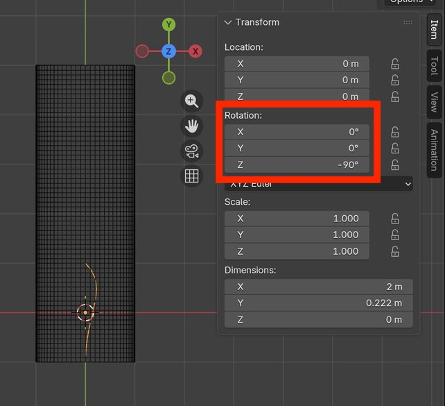
    <br>
    <br>
    <br>
</center>

Go into Edit Mode.

Select the top center point.

<center>
    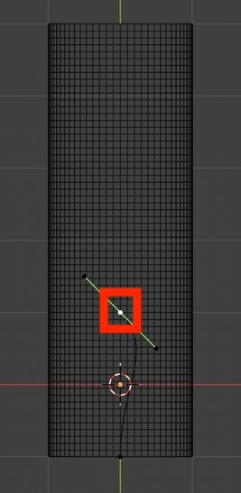
    <br>
    <br>
    <br>
</center>


Ensure that proportional editing is disabled.

<center>
    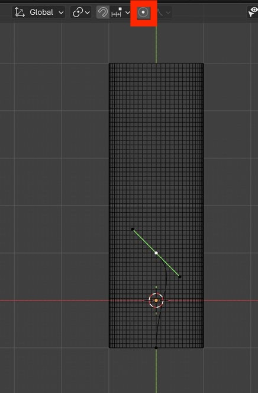
    <br>
    <br>
    <br>
</center>


Type <kbd>G</kbd> and drag the mouse until the select curve point is approximately in the location shown.

<center>
    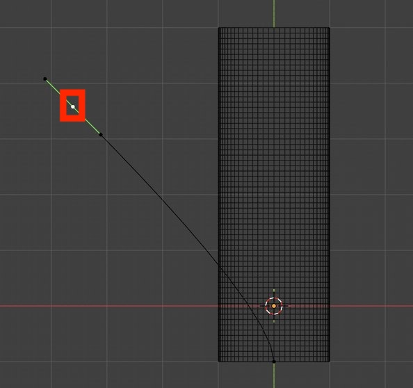
    <br>
    <br>
    <br>
</center>


Select the right point.

<center>
    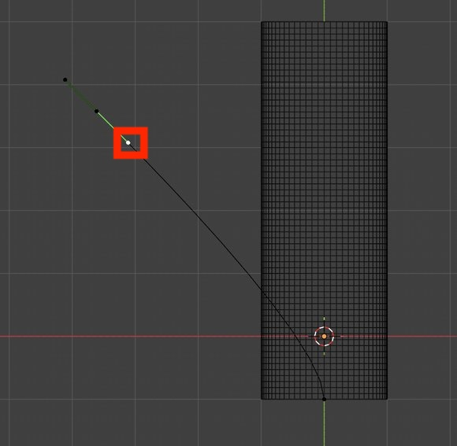
    <br>
    <br>
    <br>
</center>


Type <kbd>G</kbd> and drag the mouse until the select point is approximately in the location shown.

<center>
    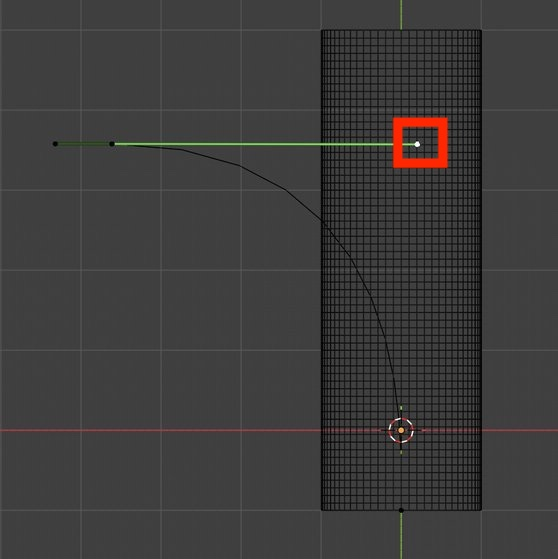
    <br>
    <br>
    <br>
</center>

Go into Object Mode.

Ensure that the Bezier curve is selected.

Go to the Curve properties panel.

Set "Resolution Preview U" to 36.


<center>
    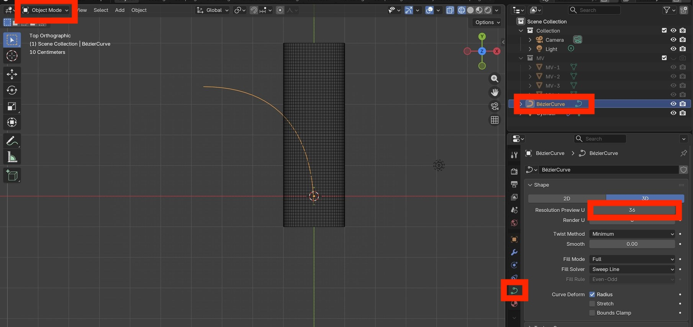
    <br>
    <br>
    <br>
</center>
# Apply modifier curve

Set viewport shading to Solid.

Select the tube.

<center>
    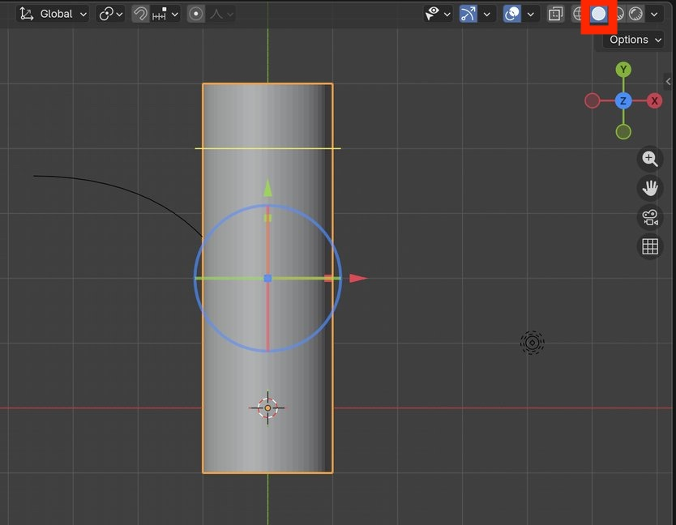
    <br>
    <br>
    <br>
</center>

Go back to the Modifers property panel and add a new curve modifier:

```
Add Modifier.. Deform.. Curve
```


<center>
    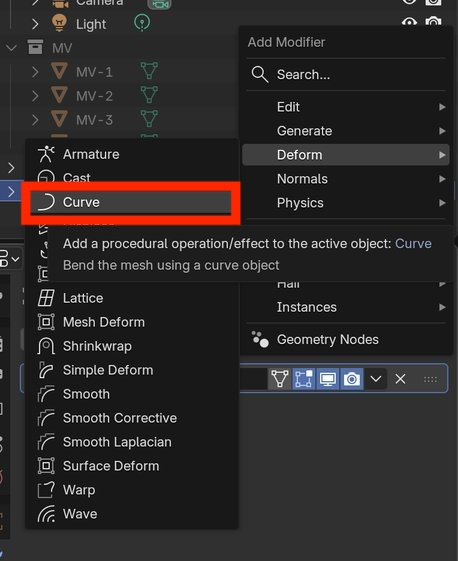
    <br>
    <br>
    <br>
</center>


Set the "Curve Object" to the Bezier Curve.

<center>
    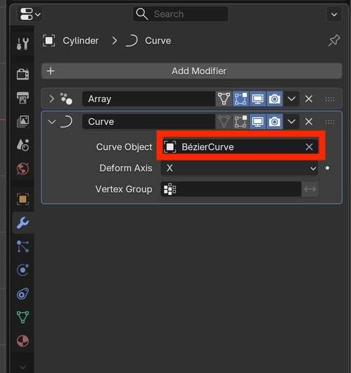
    <br>
    <br>
    <br>
</center>


Type <kbd>G</kbd> <kbd>Y</kbd> then drag your mouse downward to drag (and deform) the tube along the curve.

<center>
    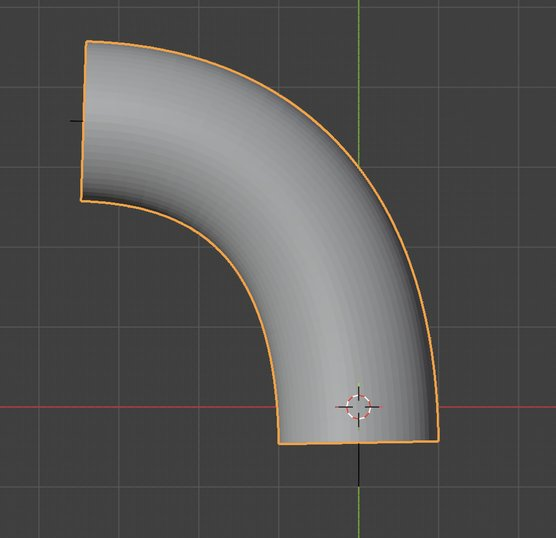
    <br>
    <br>
    <br>
</center>


# Add tube imperfection

Create a new displacement modifier:

```
Add Modifier.. Deform.. Displace
```


<center>
    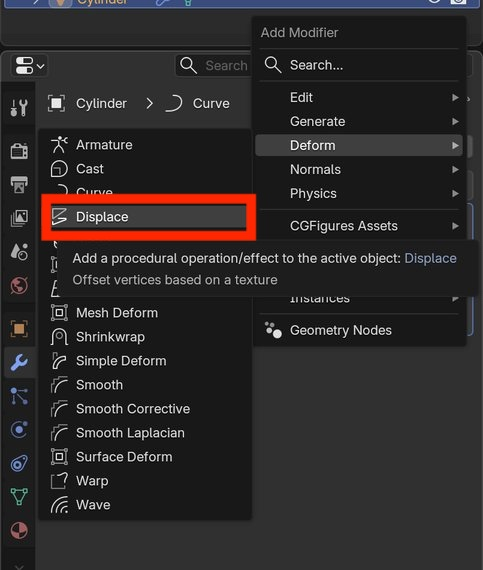
    <br>
    <br>
    <br>
</center>


Press "New"

<center>
    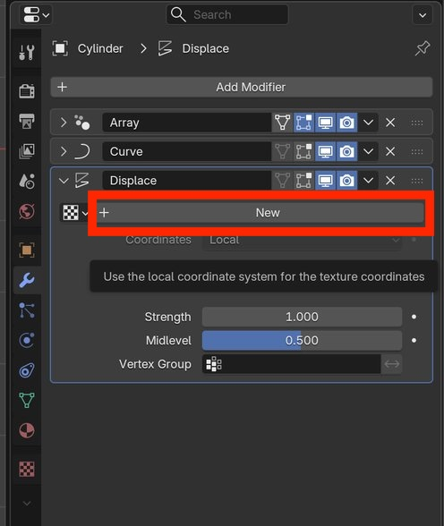
    <br>
    <br>
    <br>
</center>

Go to the texture properties panel.

Click on "Image or Movie".

<center>
    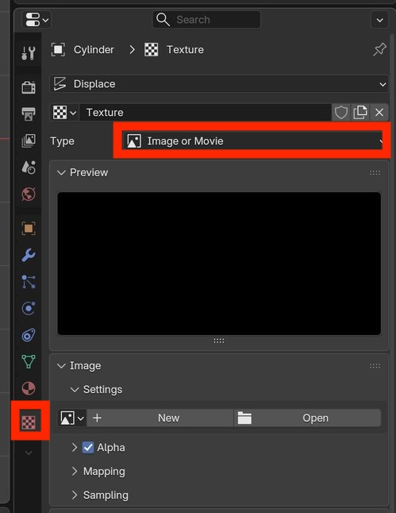
    <br>
    <br>
    <br>
</center>


Select "Clouds"

<center>
    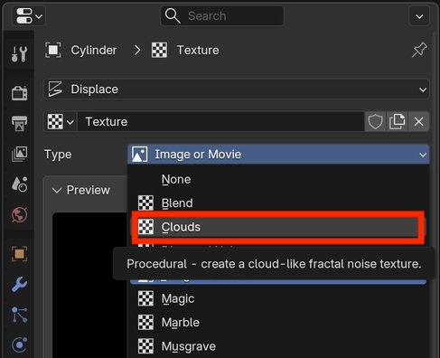
    <br>
    <br>
    <br>
</center>

Set the "Size" parameter to 1.5

<center>
    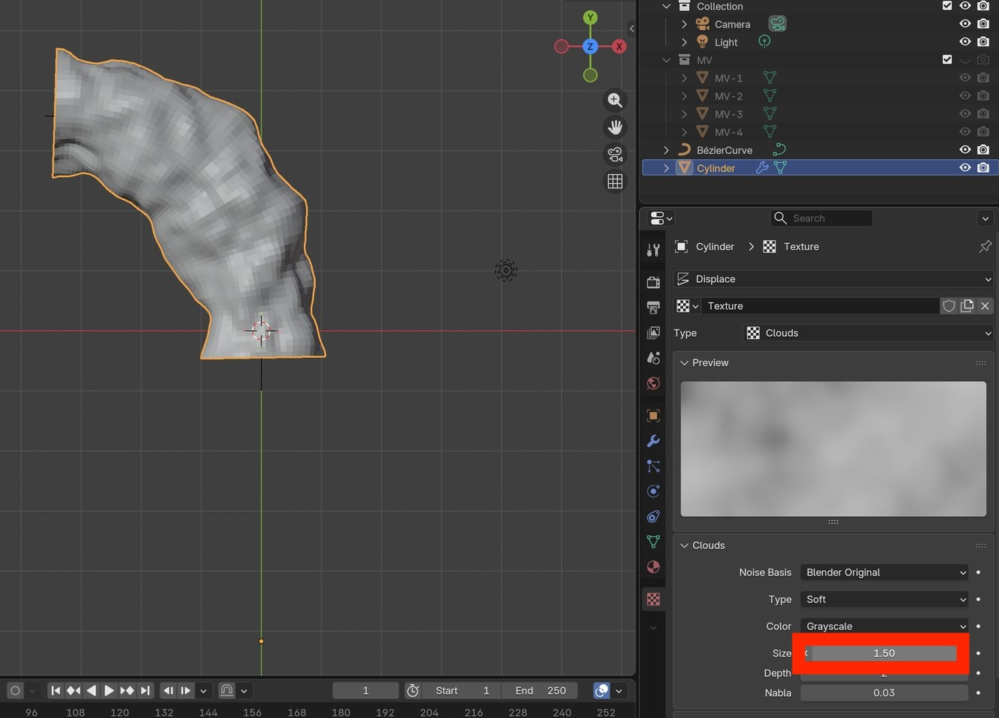
    <br>
    <br>
    <br>
</center>

Return to the Modifers panel.

Set the "Strength" parameter to 0.8

<center>
    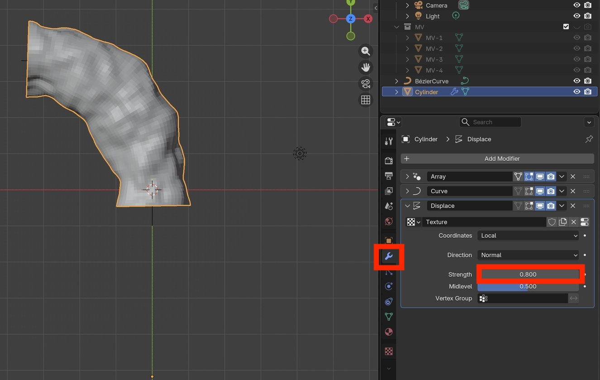
    <br>
    <br>
    <br>
</center>


Right-click on the tube and select "Shade Smooth"

<center>
    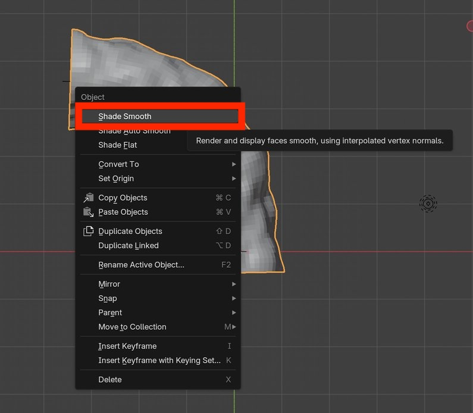
    <br>
    <br>
    <br>
</center>