# Microvilli particle system

This mini-tutorial explains how to use particle system to replicate the microvili models across the tube.

 

# Check tube vertices

Go into Object Mode.

Select the tube object that was created in the previous mini-tutorial.

    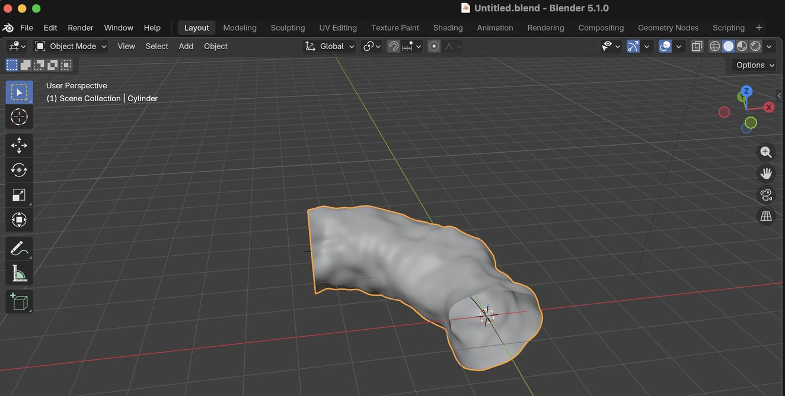
     
     
     

Right-click anywhere on the bottom bar.

Ensure that "Scene Statistics" is enabled (i.e., checked)

    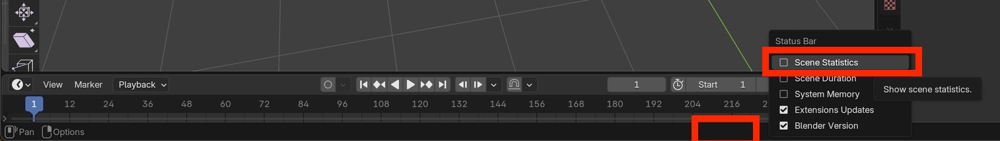
     
     
     

Go into Edit Mode.

Type <kbd>A</kbd> to select all of the vertices.

Check the number of vertices;  in the screenshot below it is 1408.

Multiply that number by 3  (i.e., by the number of cylinder segments);  in this case 1408 x 3 = 4224.  Thus there are a total of 4224 vertices in the full tube.

    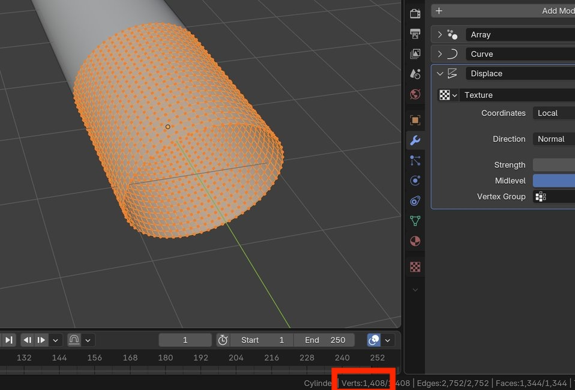
     
     
     

# Create particle system

Go back into Object Mode.

Select the particle sytems parameters panel.

Press "+" to add a particle system

    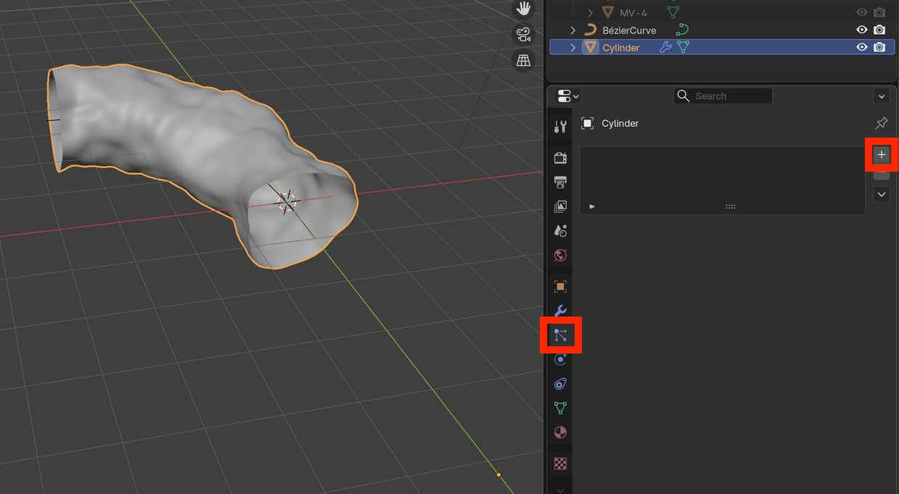
     
     
     

Set the particle system type as "Hair"

Set "Number" to the previously calculated total number of vertices (in this case 4224).

Set the following "Source" parameters:

- Emit From = "Vertices"
- Use Modifer Stack = True
- Random Order = False

    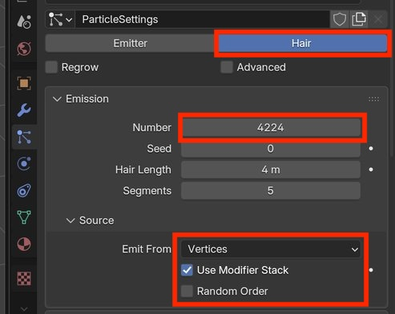
     
     
     

Further down in the particle systems panel, under "Render" set:

- Render As = "Collection"
- Scale = 0.025  (you may need to change this later depending on the size of your microvilli models)

Under "Collection" set:

- Instance Collection = "MV"  (i.e., the previously created microvilli collection)

    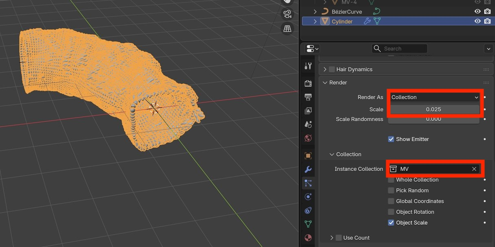
     
     
     

Set "Advanced" = True

Set "Rotation" = True

    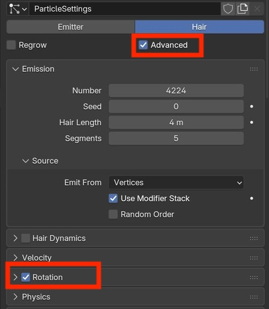
     
     
     

In the "Rotation" parameters set:

- Orientation Axis: "Normal - Tangent"

In the "Collection" parameters set:

- Object Rotation = True

    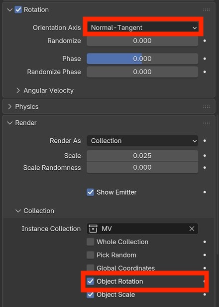
     
     
     

In the Scene Collection enable visibility for the MV collection.

Select all four of the microvilli objects.

    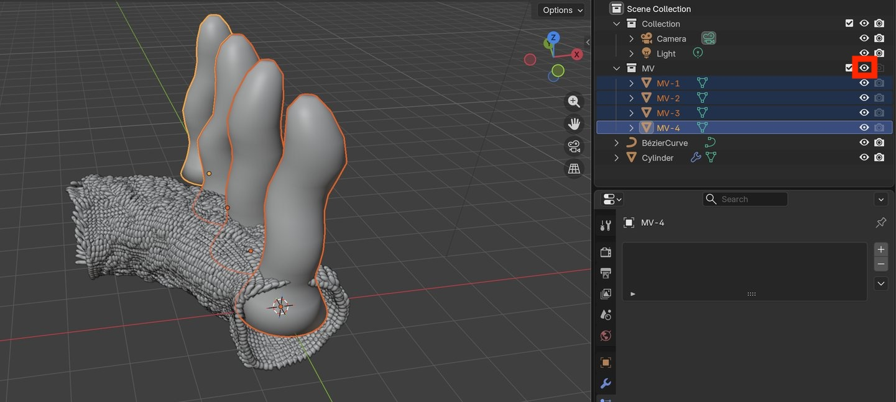
     
     
     

Rotate the microvilli objects by -90 deg in the Y direction.

    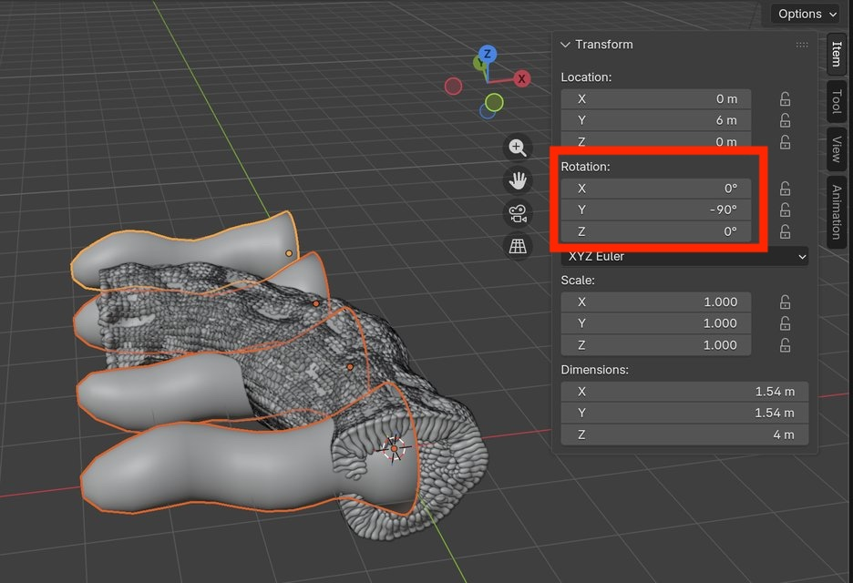
     
     
     

Disable viewport visibility for the MV collection.

Verify that the microvilli are pointing inward from the tube's inward surface.

    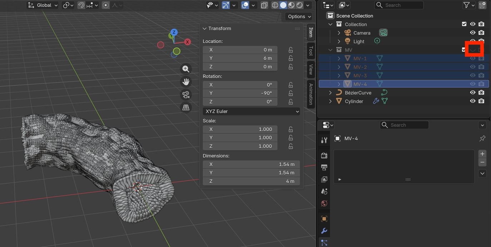
     
     
     

# Render

Select the light object.

    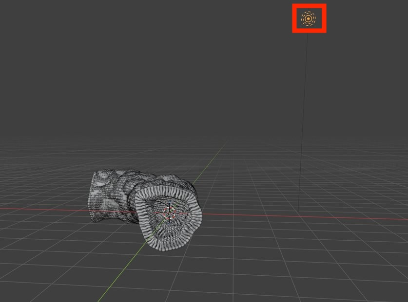
     
     
     

Set viewport shading to Rendered.

Move the light inside the tube.

    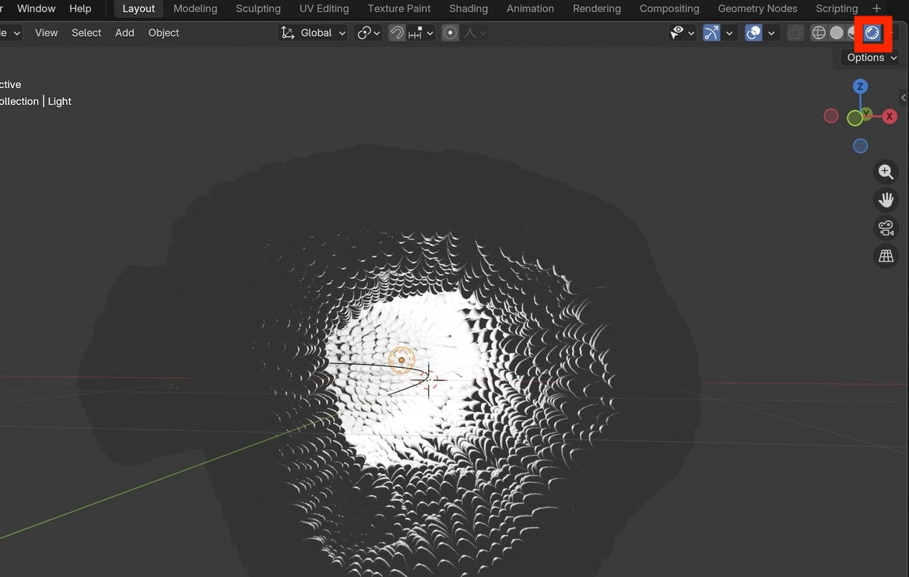
     
     
     

In the light properties panel set the power to 100 (or any other suitable value).

    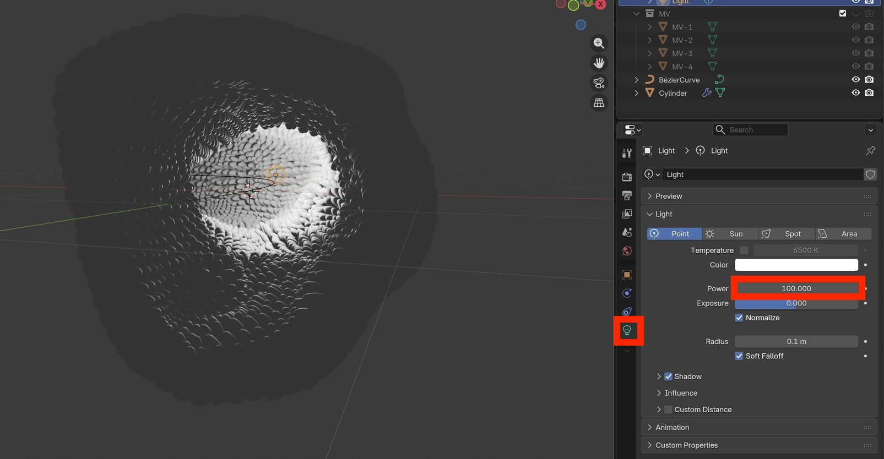
     
     
     

Optionally add more lights, in various positions and with various powers.

Move the camera so that it can see inside the tube.

Render the scene.

The rendered result should look something like this:

    
     
     
     

