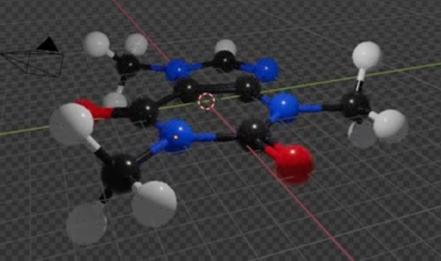

Lesson Overview

# Molecules

This tutorial explains the basics of molecular geometry visualization in Blender.  It is a simplified version of the [Working with Molecules in Blender 4.2+]( https://www.youtube.com/watch?v=s2M2mMCKpeQ ) tutorial.

The final goal of this tutorial is to produce a colored visualization of a molecule similar to this one:

    
     
     
		 

