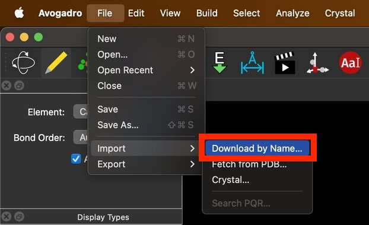
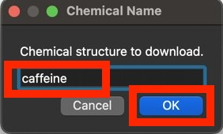
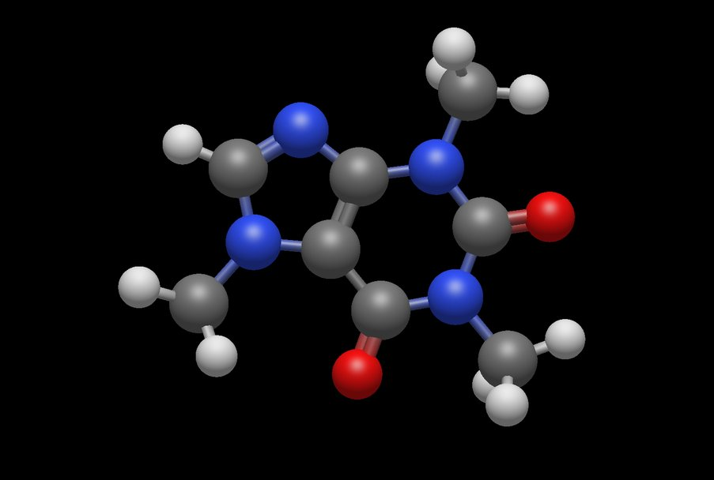
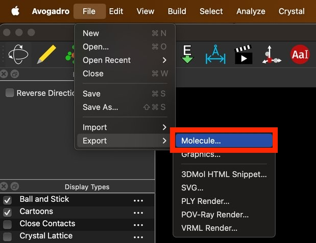
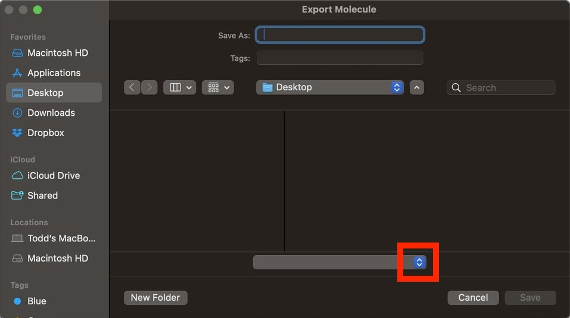
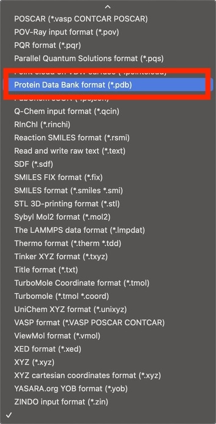
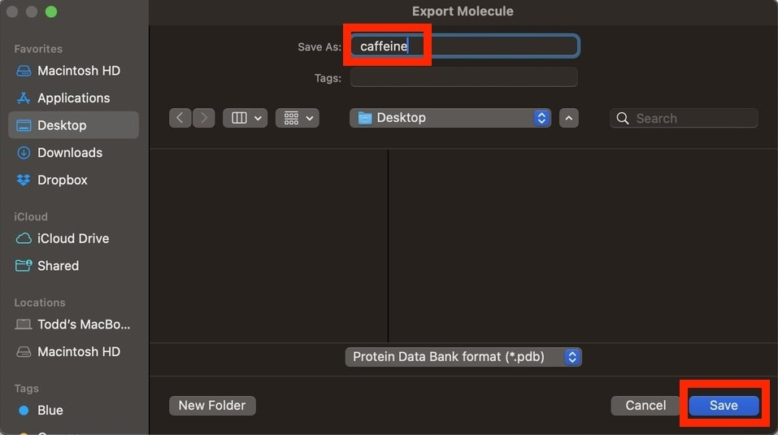
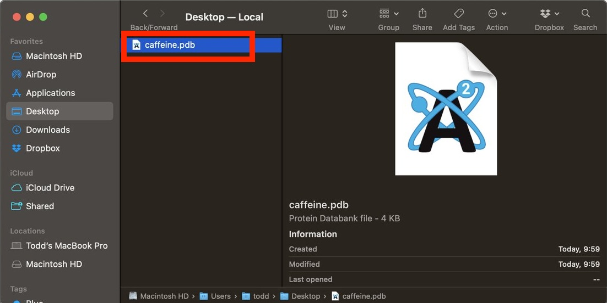

# Avogadro2

Avogadro2 is free software that allows you to create a wide variety of molecular models.

This mini tutorial describes:

- a simple way to create a molecule in Avogadro2, and
- how to export geometry from Avogadro2 for use in Blender


# Download

Download and install Avogadro2 from    https://avogadro.cc/index.html

After launching Avogadro2 the default screen looks like this:

<center>
    
    <br>
    <br>
		<br>
</center>


# Create molecule

The easiest way to create a molecule is by name.

Select:

```
File.. Import.. Download by Name..
```

<center>
    
    <br>
    <br>
		<br>
</center>


Enter a molecule name like  "caffeine", then press "OK"

<center>
    
    <br>
    <br>
		<br>
</center>


The imported molecule will look like this:

<center>
    
    <br>
    <br>
		<br>
</center>

For other molecule names search see Wikipedia:

- https://en.wikipedia.org/wiki/Lists_of_molecules

or search a chemical database like PubMed:

- https://pubchem.ncbi.nlm.nih.gov/

or search the internet for "molecule names"


# Export geometry

To export molecular geometry select:

```
File.. Export.. Molecule..
```

<center>
    
    <br>
    <br>
		<br>
</center>

Click on the format options box:

<center>
    
    <br>
    <br>
		<br>
</center>


Select the Protein Data Bank ( `.pdb`) format:

<center>
    
    <br>
    <br>
		<br>
</center>


Enter a file name like "caffeine", then press "Save"

<center>
    
    <br>
    <br>
		<br>
</center>

Confirm that you have successfully saved a `.pdb` file to your computer

Then quit Avogadro2

<center>
    
    <br>
    <br>
		<br>
</center>


