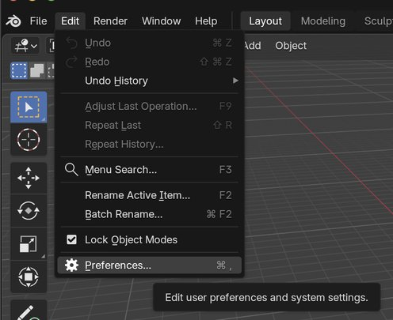

# Configure Blender

This mini tutorial describes two configuration steps that assist molecular visualization:

- Enable Atomic Blender
- Install CGFFigures


# Enable Atomic Blender


Launch Blender and select:

```
Edit.. Preferences.. Get Extensions
```


<center>
    
    <br>
    <br>
		<br>
</center>


