# Configure Blender

This mini tutorial describes two configuration steps that assist molecular visualization:

- Enable Atomic Blender
- Install CGFFigures


# Enable Atomic Blender


Launch Blender and select:

```
Edit.. Preferences
```


<center>
    
    <br>
    <br>
		<br>
</center>

In the Preferences Window:

- Click on "Get Extensions" from the left-hand menu
- In the search box (top) start to type "atomic"
- Find `Atomic Blender PDB/XYZ` and click "Install"

<center>
    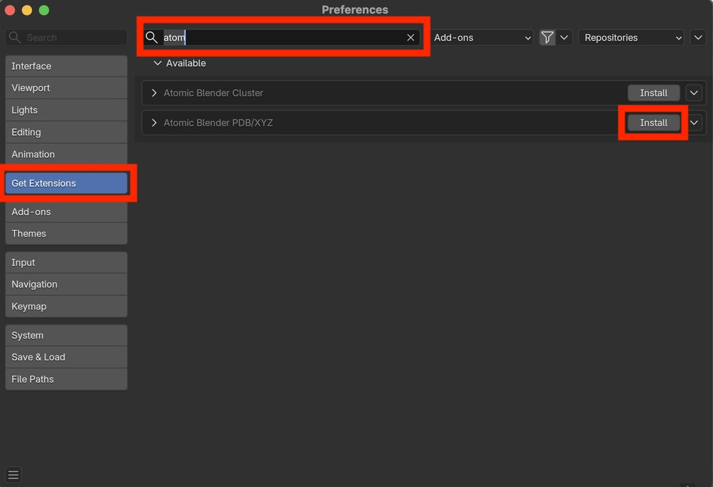
    <br>
    <br>
		<br>
</center>


Verify that the `Atomic Blender PDB/XYZ` add-on now appears in the "installed" list.

<center>
    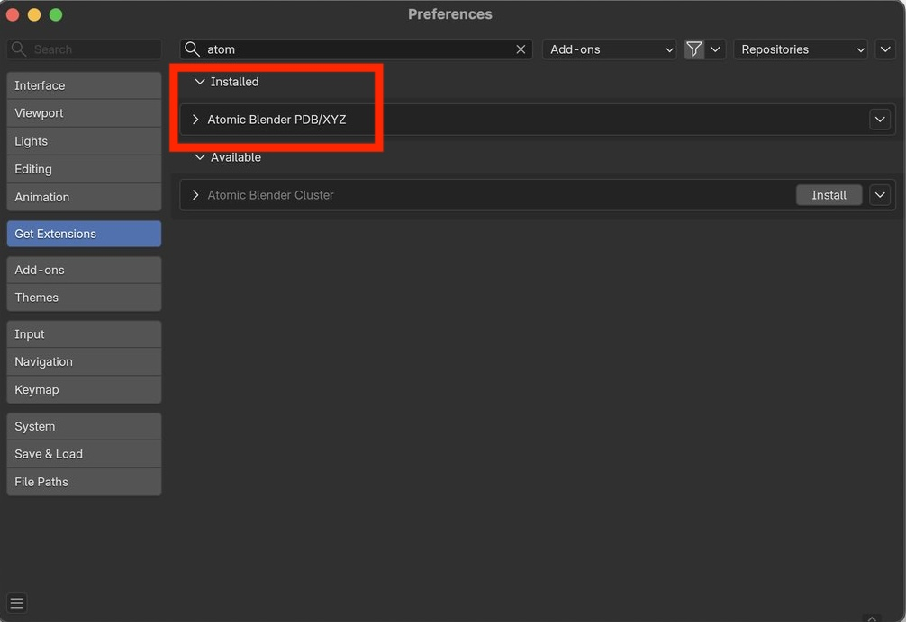
    <br>
    <br>
		<br>
</center>


# Install CGFFigures


Visit the CGFFigures website:    https://www.cgfigures.ca/assetlibrary

<center>
    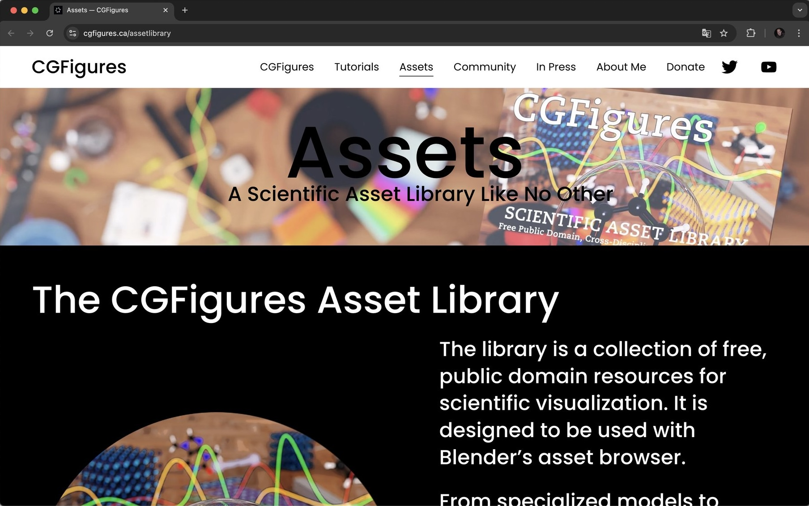
    <br>
    <br>
		<br>
</center>

Scroll down until you see "Check it out here"

Click on the underlined "here"

<center>
    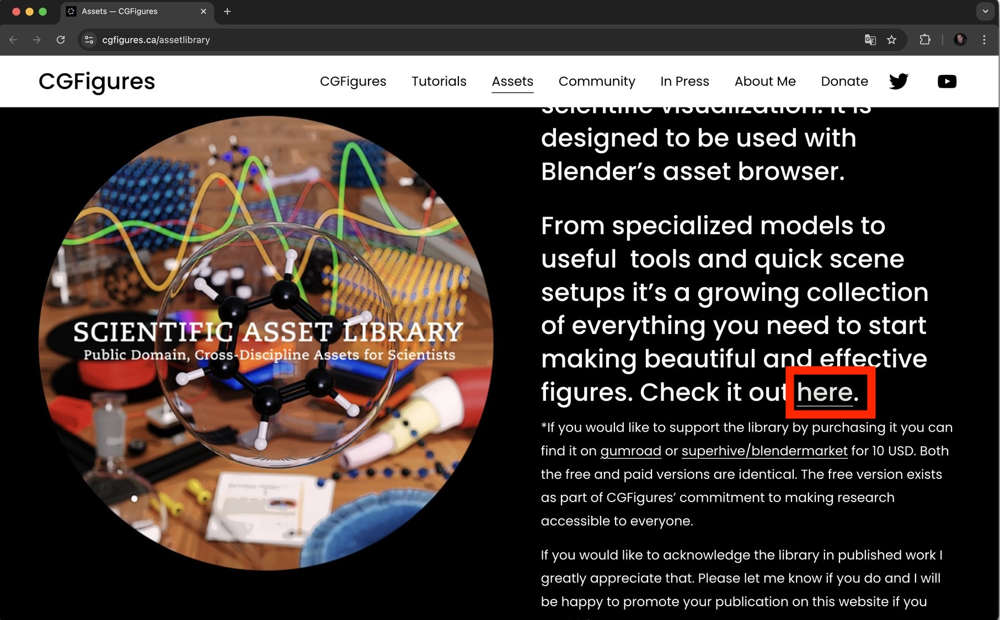
    <br>
    <br>
		<br>
</center>

You will be routed to a Google Drive folder.

Click on the "Download" button.

<center>
    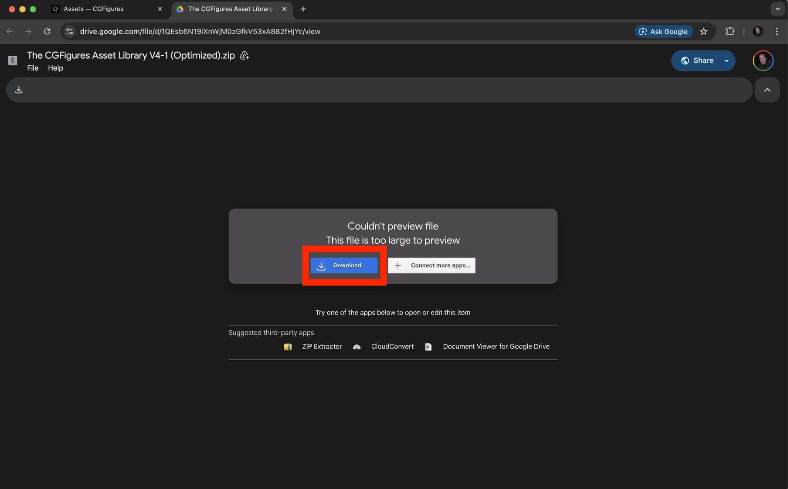
    <br>
    <br>
		<br>
</center>
Verify that the CGFigures Asset Library ZIP file has been downloaded.

This file is relatively large (about 200 MB) so it may take a while to download.


<center>
    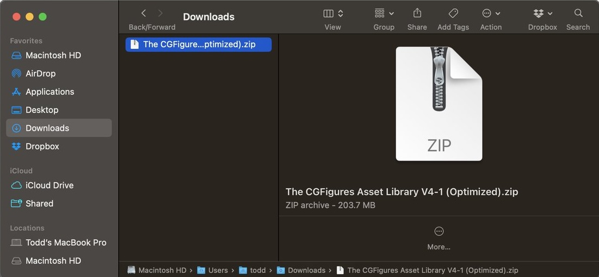
    <br>
    <br>
		<br>
</center>
Decompress (unzip) the downloaded ZIP file.

Verify that you can now see a folder called "The CGFigures Asset Library"

Also verify that this folder contains the contents depicted below.

<center>
    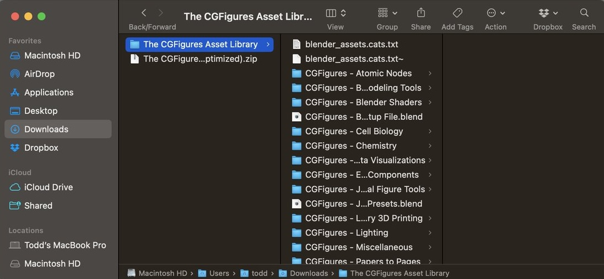
    <br>
    <br>
		<br>
</center>

Launch Blender and select:

```
Edit.. Preferences
```

<center>
    
    <br>
    <br>
		<br>
</center>
Select "File Paths" from the left-hand menu.

Then select the "+" button beside the Asset Libraries.


<center>
    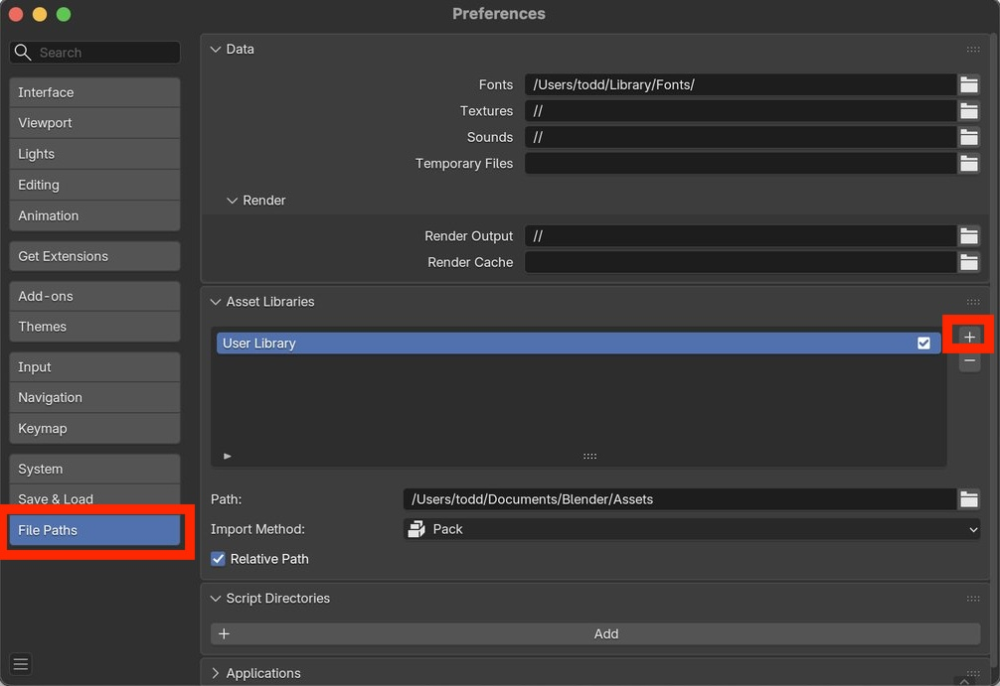
    <br>
    <br>
		<br>
</center>
In the file dialog, navigate to the unzipped folder: "The CGFigures Asset Library"

Select "Add Asset Library"

<center>
    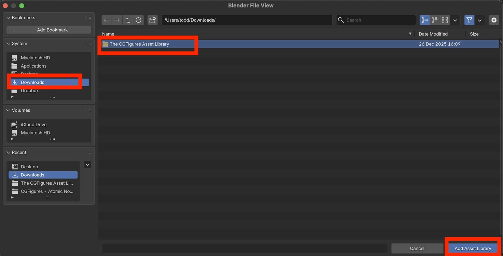
    <br>
    <br>
		<br>
</center>
The folder will open, showing you sub-folders of "The CGFigures Asset Library"

Do NOT select any of the sub-folders.

Instead press "Add Asset Library"  (i.e., press this button for a second time to select the entire "The CGFigures Asset Library" folder)

<center>
    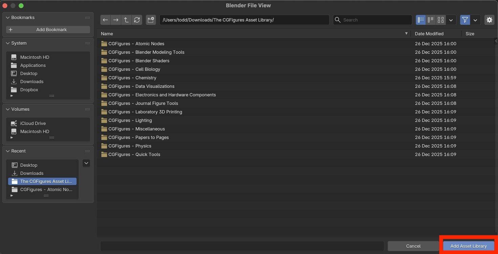
    <br>
    <br>
		<br>
</center>

Back in the Preferences panel confirm that "The CGFigures Asset Library" has been added to the Asset Libraries.

<center>
    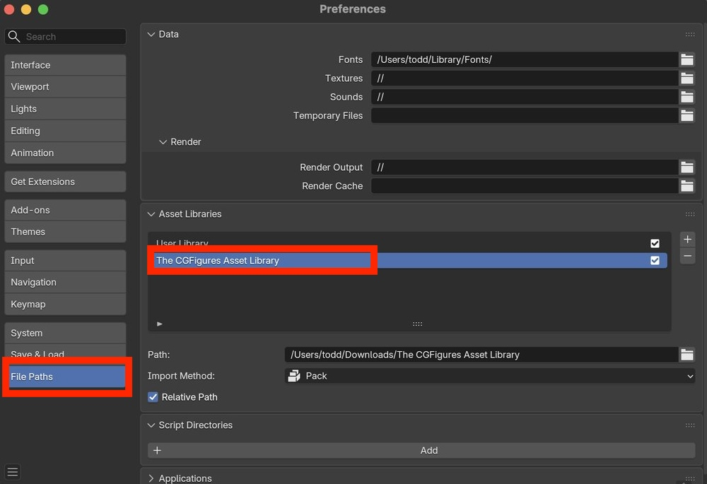
    <br>
    <br>
		<br>
</center>
Close the Preferences window.

Congratulations!  Blender is now configured for molecular visualizations!
