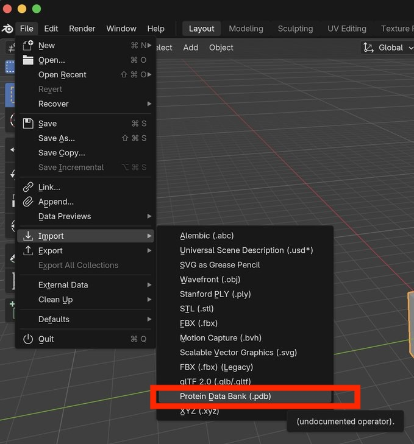
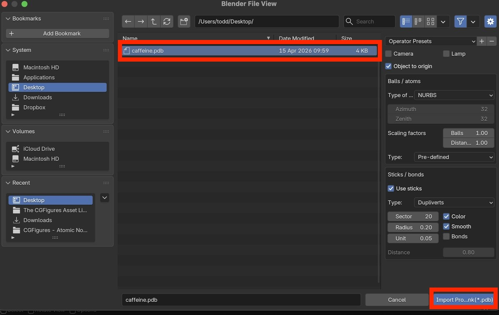
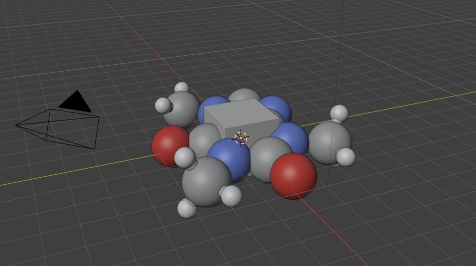

# Import molecule (basic)

This mini tutorial describes a simple way to import molecule geometry for basic visualization in Blender.

# Basic molecule import 


Launch Blender and select:

```
File.. Import.. Protein Data Bank (.pdb)..
```


<center>
    
    <br>
    <br>
		<br>
</center>


In the file dialog find the `.pdb` file that you created in the Avogadro2 mini-tutorial

Press "Import"


<center>
    
    <br>
    <br>
		<br>
</center>

You should now see the molecule!

You may optionally select the cube and press <kbd>X</kbd> to delete it.

<center>
    
    <br>
    <br>
		<br>
</center>