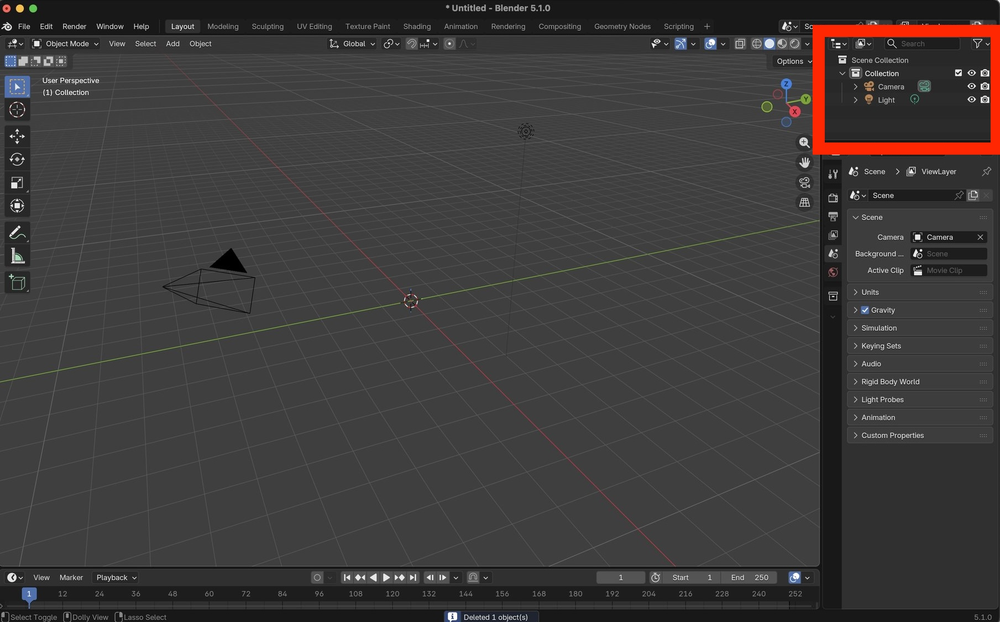
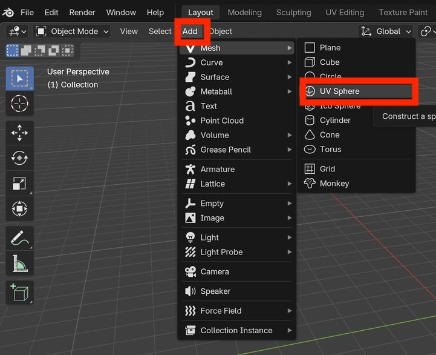
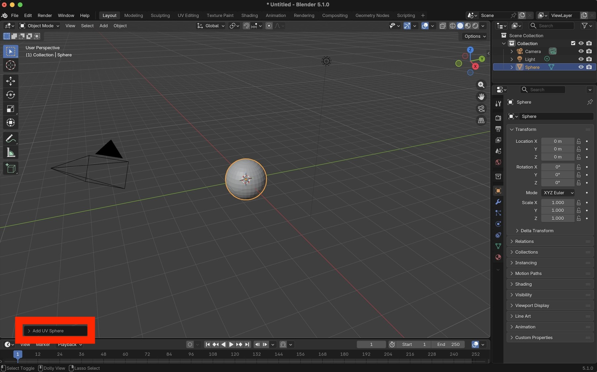
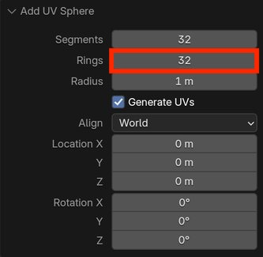
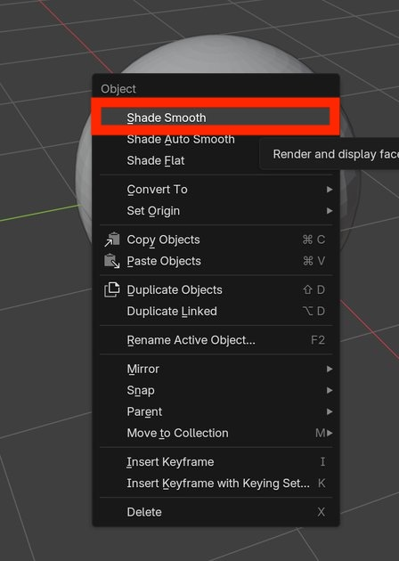
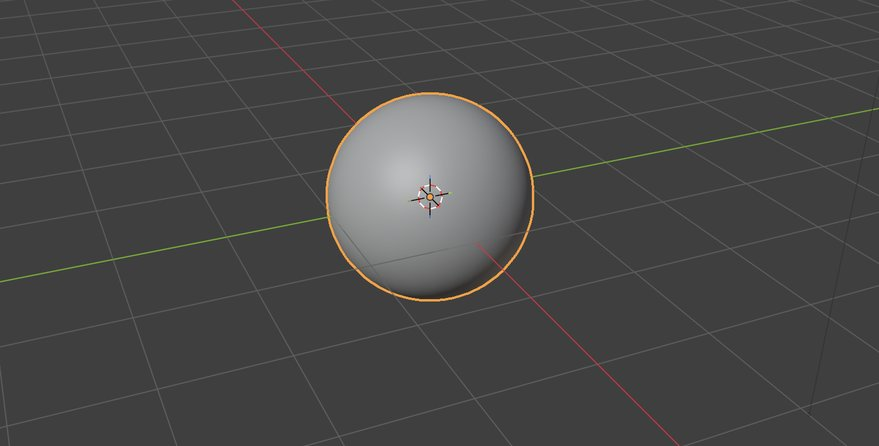

Lesson Overview

# Create virus membrane

This mini-tutorial demonstrates how to use Particle Systems to create a simple virus membrane model. 


# Initialize scene

Launch Blender.

Select the cube and press <kbd>X</kbd> to delete the cube.

Verify that the cube does not appear in the Scene Collection.

<center>
    
    <br>
    <br>
    <br>
</center>


# Create sphere

A vrius membrane can be modeled as a sphere.

To add a UV sphere object:

```
Add.. Mesh.. UV Sphere
```


<center>
    
    <br>
    <br>
    <br>
</center>


WITHOUT deselecting the sphere, click the arrow on the "Add UV Sphere" dialog

<center>
    
    <br>
    <br>
    <br>
</center>


Set the number of Rings to 32

<center>
    
    <br>
    <br>
    <br>
</center>


Right-click on the sphere and select "Shade Smooth"

<center>
    
    <br>
    <br>
    <br>
</center>


Verify that the sphere is shaded smoothly in the 3D Viewport.


<center>
    
    <br>
    <br>
    <br>
</center>
