# Create spike

This mini-tutorial demonstrates how to create a simple virus spike model from basic cylinder geometry.


# Create base geometry

Add a cylinder as an initial basic spike model:

```
Add.. Mesh.. Cylinder
```


<center>
    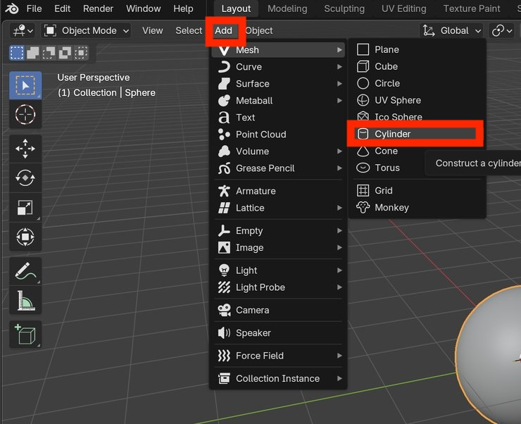
    <br>
    <br>
    <br>
</center>


Press "X" on the navigation axes to change the view to the YZ plane.

Move the cylinder away from the sphere.

> [!IMPORTANT]
> Press the X-ray button.


<center>
    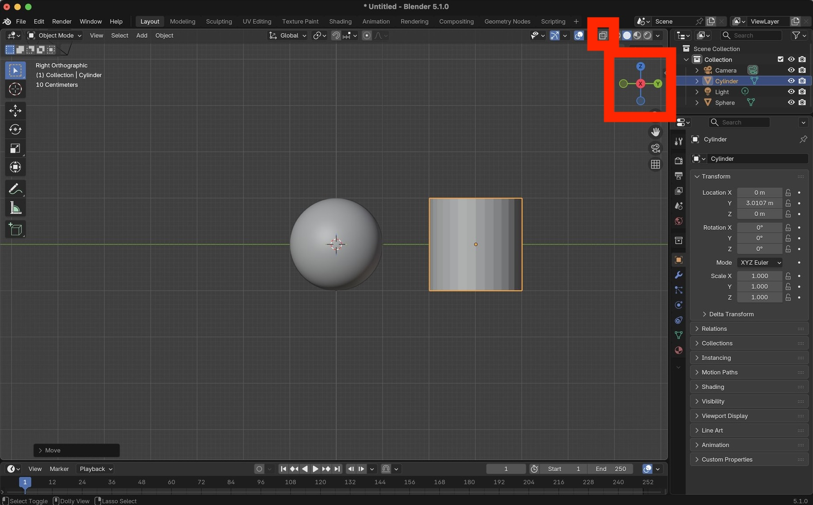
    <br>
    <br>
    <br>
</center>

Change to Edit Mode

Select the top nodes, then press <kbd>S</kbd> and then <kbd>Y</kbd> to scale in the Y direction.

Drag the mouse to narrow the top part of the cylinder.

<center>
    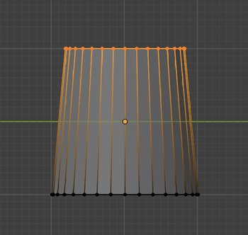
    <br>
    <br>
    <br>
</center>


Press <kbd>E</kbd> to extrude the top surface, then drag your mouse to produce a new layer of nodes.

Press <kbd>ENTER</kbd> to apply the extrusion.

<center>
    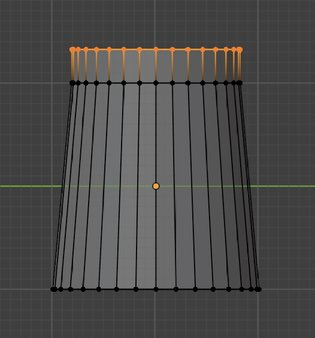
    <br>
    <br>
    <br>
</center>


Repeat extrusion several times.

<center>
    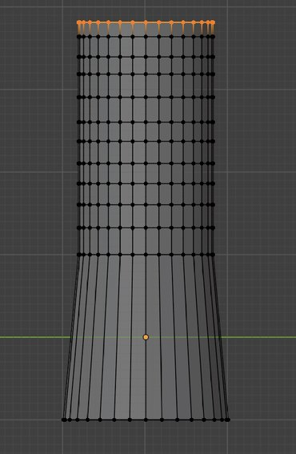
    <br>
    <br>
    <br>
</center>


Select one layer of vertices.

<center>
    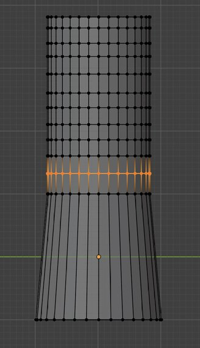
    <br>
    <br>
    <br>
</center>


Press <kbd>S</kbd> and then <kbd>Y</kbd> to scale the layer of vertices in the Y direction.

Repeat for each layer of vertices to create a spike-like shape.

<center>
    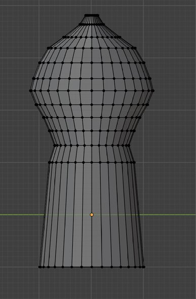
    <br>
    <br>
    <br>
</center>


Enable proportional editing.

<center>
    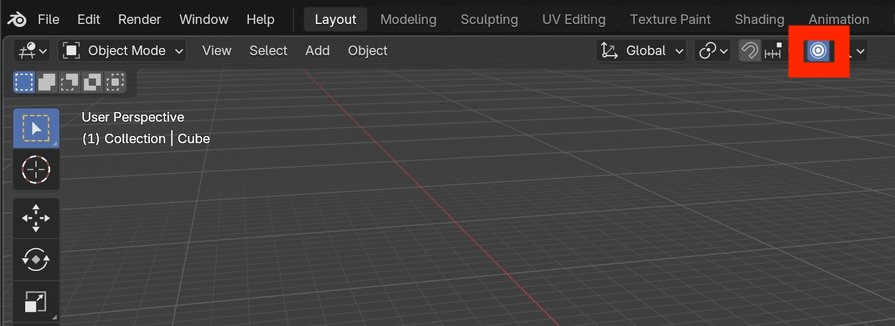
    <br>
    <br>
    <br>
</center>

Select to the top vertices, then press <kbd>G</kbd> and drag the mouse downward.

If proportional editing is enabled you will see a large grey circle around the selected nodes.

<center>
    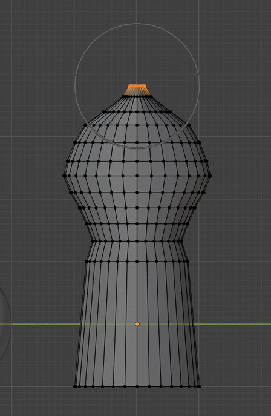
    <br>
    <br>
    <br>
</center>

Proportional editing will displace not only the selected vertices, but also surrounding vertices.

Drag the vertices downward until the spike looks like this:

<center>
    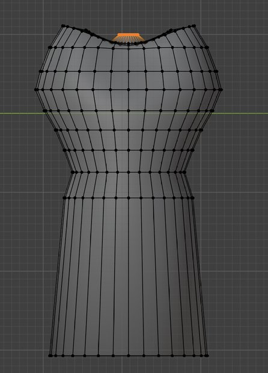
    <br>
    <br>
    <br>
</center>


Press the "Z" button on the navigation axes to change the view to the XY plane.

Verify that the top vertices are still selected.


<center>
    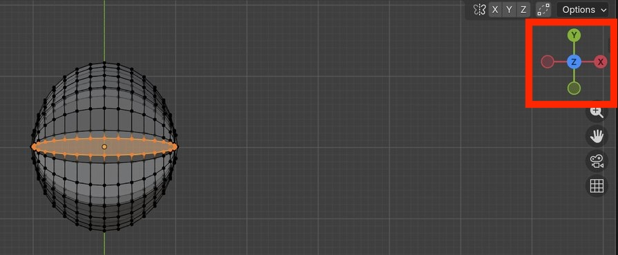
    <br>
    <br>
    <br>
</center>

Press <kbd>S</kbd> then <kbd>X</kbd> to and drag the mouse to scale in the X direction.

Press <kbd>ENTER</kbd> to apply.

<center>
    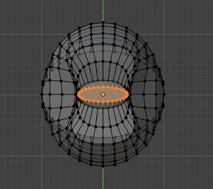
    <br>
    <br>
    <br>
</center>


Exit Edit Mode and return to Object Mode.

<center>
    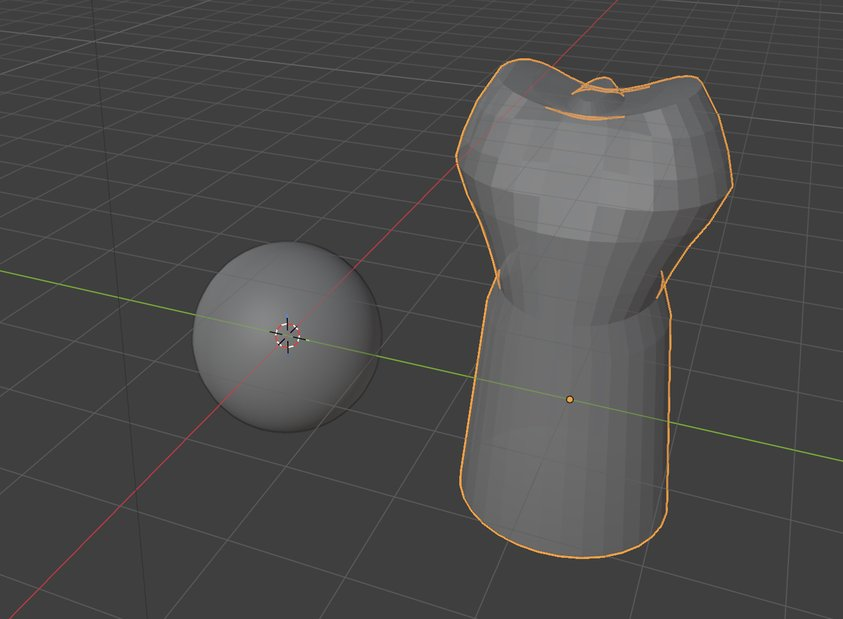
    <br>
    <br>
    <br>
</center>


Right-click on the spike and select "Shade Smooth"

<center>
    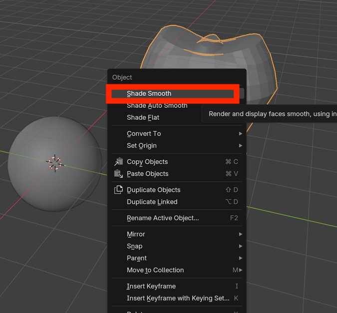
    <br>
    <br>
    <br>
</center>


Verify that the spike has been shaded smoothly in the 3D Viewport.

<center>
    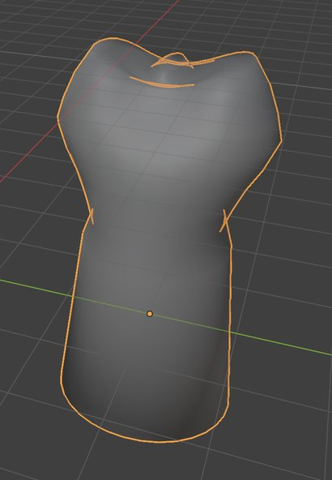
    <br>
    <br>
    <br>
</center>


Return to the YZ view.

<center>
    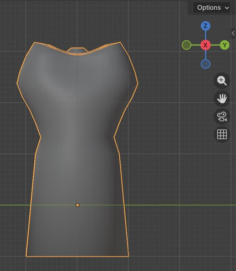
    <br>
    <br>
    <br>
</center>


Enter Edit Mode.

Press <kbd>A</kbd> to select all vertices.

Verify that the spike geometry does NOT start at the Y axis (i.e., Y=0).

<center>
    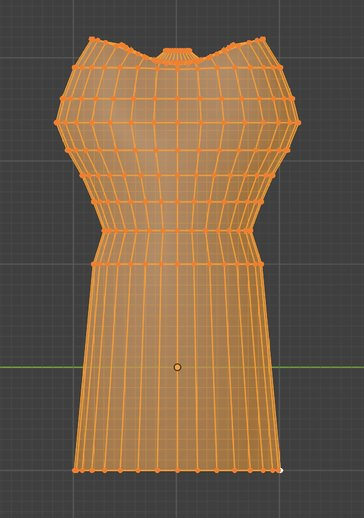
    <br>
    <br>
    <br>
</center>


Press <kbd>G</kbd> then drag the mouse up to move the spike up until it starts at Y=0

<center>
    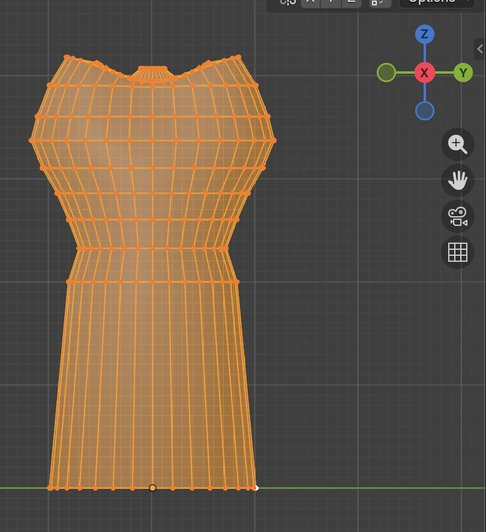
    <br>
    <br>
    <br>
</center>


Return to Object Mode.

Press <kbd>N</kbd> to show the side panel.

Set the X rotation to -90 so that the spike points in the +Y direction.

<center>
    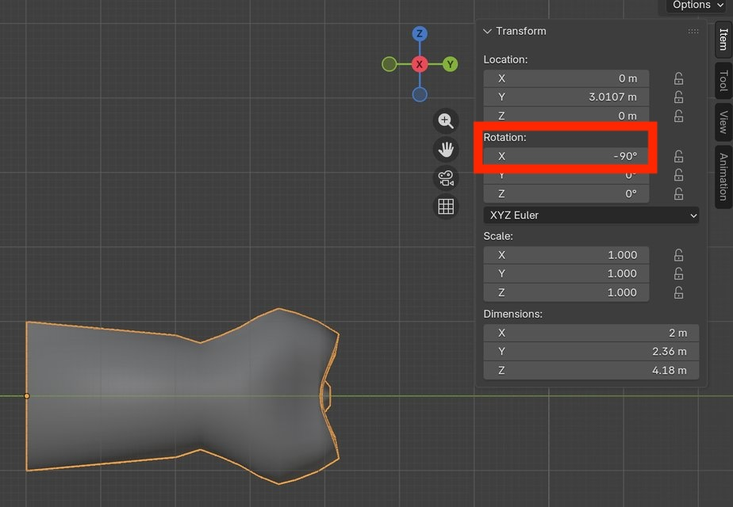
    <br>
    <br>
    <br>
</center>


Apply the transforms by selecting:

```
Object.. Apply.. All Transforms
```


<center>
    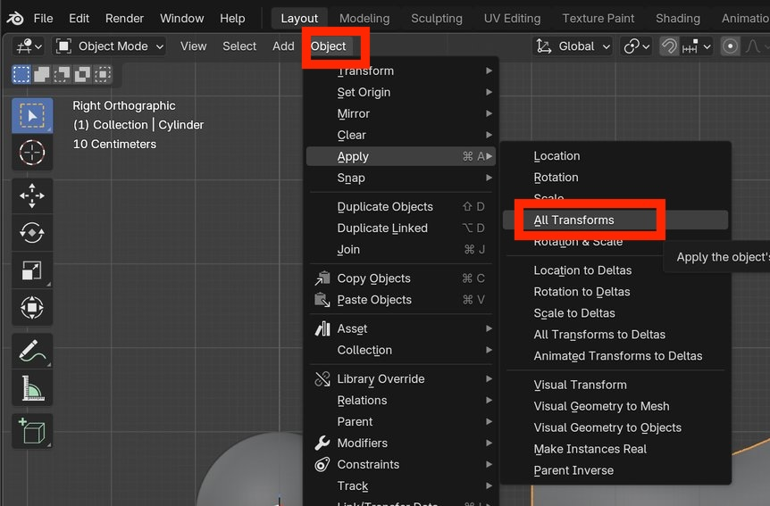
    <br>
    <br>
    <br>
</center>


Verify that the locations and rotations are now 0, and that the scale is 1.

<center>
    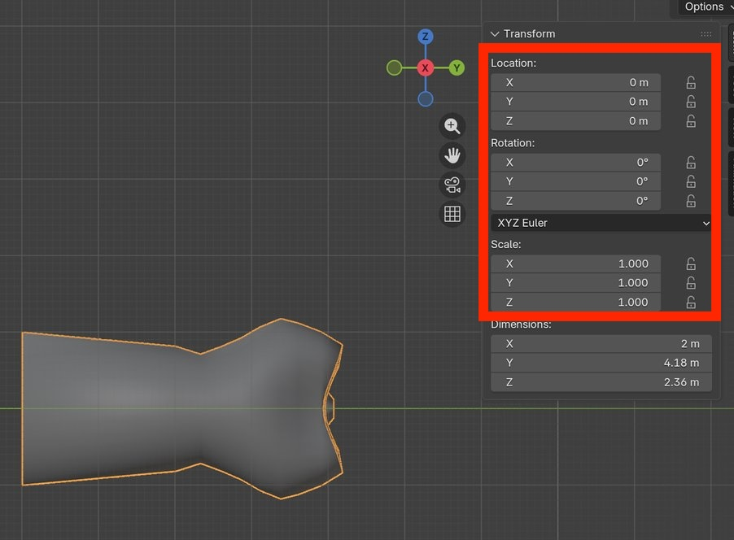
    <br>
    <br>
    <br>
</center>


# 