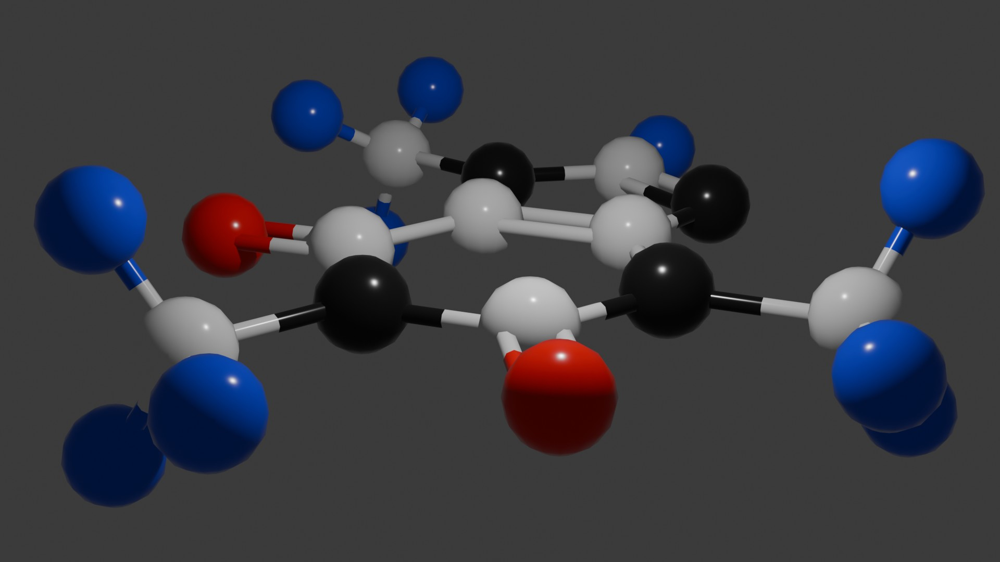

# iss-blender
This repository contains tutorials for the ISS-E2 "3D Modeling and Animation" seminar at Kyoto University.

This seminar is part of the larger ISS-E2 course entitled: "Designing the Future: From the Origin of Life to Future Life"

# Lessons

All lessons are simplified versions of existing public video tutorials. Links to these video tutorials can be found in each lesson's documentation.

The main goal of these lessons is to quickly expose students to several Blender techniques that are relevant to modeling and visualizing biological systems. The main techniques include:

- Geometry nodes
- Particle systems
- Mesh modifiers
- Blender add-ons and extension configuration for external compatability

 

### [Geometry nodes](Lessons/GeometryNodes)

Use Blender's geometry nodes to create vines and leaves.

 

### [Molecules](Lessons/Molecules)

Use Blender to visualize molecules in Protein Databank Format.

 

### [Viruses](Lessons/Viruses)

Use particle systems to create a simple virus model in Blender.

 

### [Microvilli](Lessons/Microvilli)

Use Blender's modifiers and particle systems to create a microvilli visualization.

 